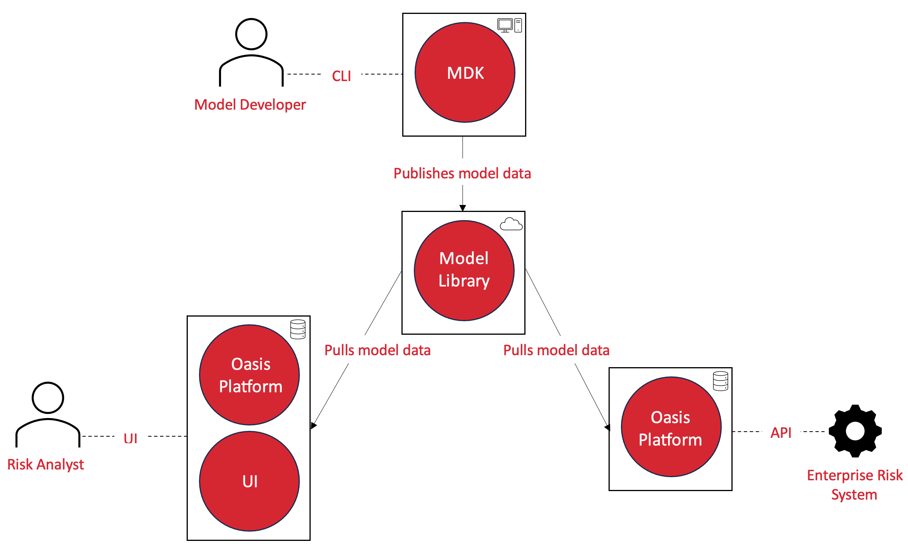

Oasis LMF Documentation
=======================

* **What is Oasis**: The Oasis Loss Modelling Framework is an open source catastrophe modelling
  platform, free to use by anyone. It is also a community that seeks to unlock and change the
  world around catastrophe modelling to better understand risk in insurance and beyond. While
  its development is largely driven by the global (re-)insurance community, it seeks to provide
  tools and utility to all. For more information visit `oasislmf.org <http://www.oasislmf.org/>`_.

* **How this documentation is organised**: Each Oasis component owns and publishes its own
  documentation. This site aggregates those component sites — pinned to specific versions — into
  one place. Pick a component below, or start from a use case.

|

Overview
--------

    Oasis Ecosystem

|

Documentation by component
--------------------------

.. grid:: 1 1 2 3
    :gutter: 3

    .. grid-item-card:: OasisLMF — MDK & kernel
        :link: oasislmf/index.html
        :link-type: url

        The Model Development Kit and the loss-calculation kernel (pytools): GUL, FM, outputs,
        keys/lookup, methodology.

    .. grid-item-card:: Oasis Platform
        :link: platform/index.html
        :link-type: url

        The API, workers and deployment — running models at scale, and driving them via the API.

    .. grid-item-card:: ODS Tools
        :link: ods-tools/index.html
        :link-type: url

        Loading/validating OED, transforming to OED (ODTF), and the analysis/model settings
        schema reference.

    .. grid-item-card:: Open Exposure Data (OED)
        :link: oed/index.html
        :link-type: url

        The exposure data standard — file structure, hierarchy, field and coded-value reference.

    .. grid-item-card:: Open Results Data (ORD)
        :link: ord/index.html
        :link-type: url

        The results data standard — result tables, fields and worked examples.

    .. grid-item-card:: Oasis Models
        :link: models/index.html
        :link-type: url

        Example and reference models (e.g. PiWind) and how model data is packaged.

|

The Oasis initiative
--------------------

**Model developers** build, test and publish risk models — typically scientists or software
developers in a modelling company or academia.

**Risk analysts** operate the models for decision support — analysts at (re)insurers running
models for pricing and portfolio management, plus government and third-sector users.

**Enterprise risk systems** integrate Oasis models via APIs into pricing and portfolio
management workflows.

.. toctree::
    :hidden:
    :titlesonly:
    :caption: Home:

    home/introduction.rst
    Oasis GitHub <https://github.com/OasisLMF>
    home/git-repo.rst
    home/FAQs.rst

.. toctree::
    :hidden:
    :titlesonly:
    :caption: Use Cases:

    use_cases/model-developer
    use_cases/model-users
    use_cases/installing-deploying-Oasis
