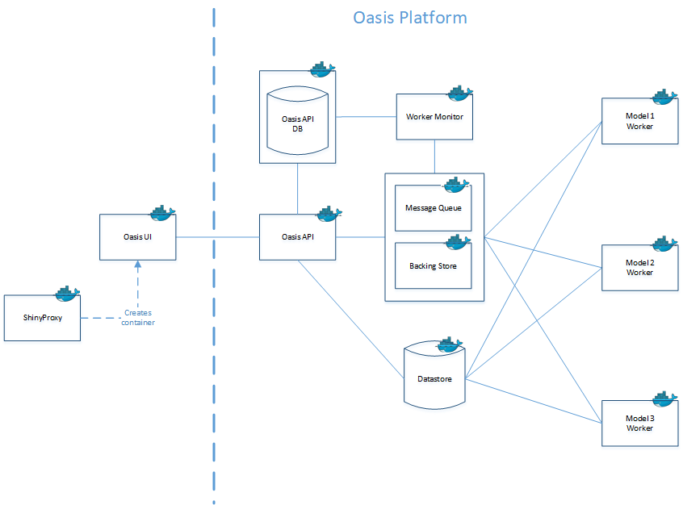
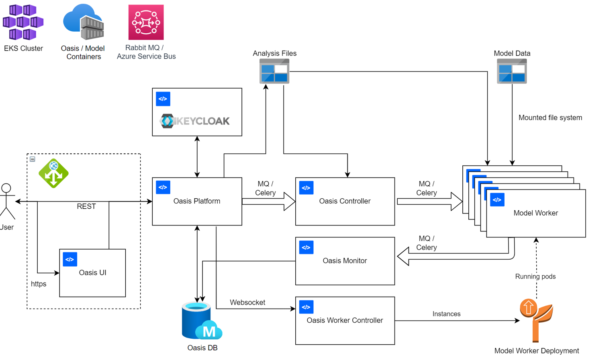

API
===

On this page
------------

* :ref:`intro_api`
* :ref:`oasis_api`
* :ref:`deployment_api`
* :ref:`links_api`

|

.. _intro_api:
Introduction:
*************

----

Oasis has a full REST API for managing exposure data and operating modelling workflows. API Swagger documentation can be 
found `here <http://api.oasislmfdev.org/swagger/>`_. An evaluation version of the Oasis platform and using can be deployed 
using the `Oasis evaluation repository <https://github.com/OasisLMF/OasisEvaluation>`_. This includes a Jupyter notebook 
that illustrates the basic operation of the API, using the Python API client.

|

.. _oasis_api:

Oasis API
*********

----

The Oasis Platform release now includes a full API for operating catastrophe models and a general consolidation of the 
platform architecture. Windows SQL server is no longer a strict requirement. The platform can be run via docker containers 
on a single machine or, if required, scaled up to run on a cluster.

Docker support is the main requirement for running the platform. A Linux based installation is the main focus of this 
example deployment. Running the install script from this repository automates install process of the OasisPlatform API v1, 
User Interface and example PiWind model.

The **Oasis API** is the components of the Oasis platform that manages all the elements of the plaform that are required to 
build, run, and test models. The diagram below shows how the **Oasis API** sits behind the :doc:`Oasis-UI`, that you use to 
operate your catastrophe models.

*Oasis docker componets*:

|

|

.. _deployment_api:

API deployment in the Oasis Enterprise Platform
***********************************************

----

The **Oasis Enterprise Platform** is an open source `Kubernetes <https://kubernetes.io/docs/concepts/overview/>`_ based, 
cloud computing cluster, which is deployable in `Microsoft Azure <https://azure.microsoft.com/en-gb/resources/
cloud-computing-dictionary/what-is-azure/>`_ via `Helm charts <https://helm.sh/docs/topics/charts/>`_ and `Bicep scripts 
<https://learn.microsoft.com/en-us/azure/azure-resource-manager/bicep/deployment-script-bicep>`_ to setup the Azure cloud 
services. The diagram below sets out the **Oasis Enterprise Platform** architecture:

|

.. _links_api:

Links for further information
*****************************

----

There is more information availible in the `Oasis GitHub <https://github.com/OasisLMF>`_. 

This includes detailed walkthorughs on:

|

1. Oasis implementation of `Microsoft Azure <https://azure.microsoft.com/en-gb/resources/cloud-computing-dictionary/what-is-azure/>`_.

This guide takes you through the `requirements <https://github.com/OasisLMF/OasisAzureDeployment/blob/
master/README.md#1-Requirements>`_ for using this platform, how to `setup the enviroment <https://github.com/OasisLMF/
OasisAzureDeployment/blob/master/README.md#2-Setup-environment>`_, how to `use the platform <https://github.com/OasisLMF/
OasisAzureDeployment/blob/master/README.md#3-Use-the-platform>`_, how to `manage resource groups <https://github.com/
OasisLMF/OasisAzureDeployment/blob/master/README.md#4-Manage-resource-groups>`_, `deployment without the pipeline <https://
github.com/OasisLMF/OasisAzureDeployment/blob/master/README.md#5-Deploy-without-the-pipeline>`_, `securing the plaform 
<https://github.com/OasisLMF/OasisAzureDeployment/blob/master/README.md#6-Secure-the-platform>`_, `troubleshooting <https://
github.com/OasisLMF/OasisAzureDeployment/blob/master/README.md#7-Troubleshooting>`_, and it answers some additional 
`questions about the design <https://github.com/OasisLMF/OasisAzureDeployment/blob/master/README.md#8-Questions-about-design>`_.

`LINK <https://github.com/OasisLMF/OasisAzureDeployment/blob/master/README.md#8-Questions-about-design>`_ - Oasis implmentation of Microsoft Azure.

|

2. How to implement `Kubernetes <https://kubernetes.io/docs/concepts/overview/>`_.

This guide takes you through `requirements <https://github.com/OasisLMF/OasisPlatform/blob/platform-2.0/kubernetes/charts/
README.md#requirements>`_, how to `build images <https://github.com/OasisLMF/OasisPlatform/blob/platform-2.0/kubernetes/
charts/README.md#build-images>`_, a `quick start <https://github.com/OasisLMF/OasisPlatform/blob/platform-2.0/kubernetes/
charts/README.md#quick-start>`_ tutorial, how to `access the user interfaces <https://github.com/OasisLMF/OasisPlatform/
blob/platform-2.0/kubernetes/charts/README.md#accessing-user-interfaces>`_, and introduction to `helm and customisation 
<https://github.com/OasisLMF/OasisPlatform/blob/platform-2.0/kubernetes/charts/README.md#helm-and-customization>`_, `chart 
details <https://github.com/OasisLMF/OasisPlatform/blob/platform-2.0/kubernetes/charts/README.md#chart-details>`_, and 
`keycloak <https://github.com/OasisLMF/OasisPlatform/blob/platform-2.0/kubernetes/charts/README.md#keycloak>`_, and how to 
access `help scripts <https://github.com/OasisLMF/OasisPlatform/blob/platform-2.0/kubernetes/charts/README.md#help-scripts>`_.

`LINK <https://github.com/OasisLMF/OasisPlatform/blob/platform-2.0/kubernetes/charts/README.md#helm-and-customization>`_ - how to implement Kubernetes.

|

3. How to deploy and manage the Oasis platform on a `Kubernetes <https://kubernetes.io/docs/concepts/overview/>`_ cluster.

`LINK <https://github.com/OasisLMF/OasisPlatform/blob/platform-2.0/kubernetes/README.md>`_ - how to deploy and manage the Oasis platform on a Kubernetes cluster.

|

4. Oasis Worker Controller.

This application controls the number of workers in a kubernetes cluster based on analyses currently running, worker 
deployments available and autoscaling configuration for each worker deployment.

`LINK <https://github.com/OasisLMF/OasisPlatform/blob/platform-2.0/kubernetes/worker-controller/README.md>`_ - Oasis Worker Controller.