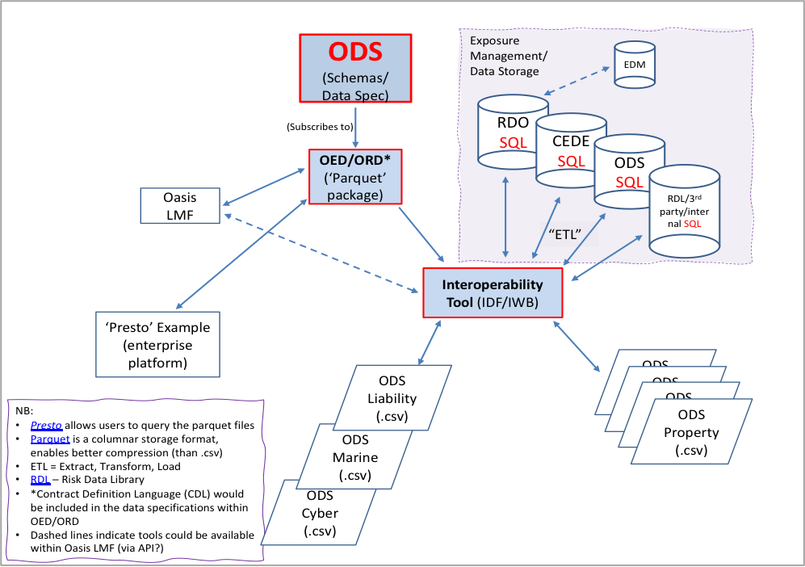
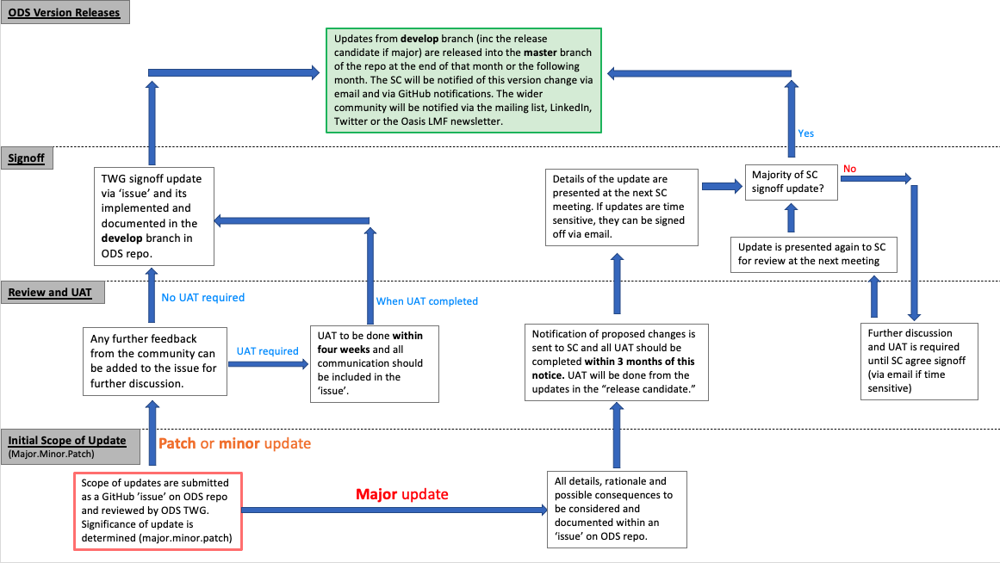

ODS - Open Data Standards
=========================

|
On this page:

* :ref:`intro_ODS`
* :ref:`structure`
* :ref:`committee`
* :ref:`links_ODS`

.. _intro_ODS:

Introduction
------------

Open Data Standards (ODS) are a set of specifications and guidelines that define how data should be structured, formatted,
and shared in an open and interoperable manner. These standards enable data to be easily exchanged, accessed, and 
understood by different systems, organizations, and users. Its aim is to be the standard used for exposure data, result 
outputs and contract(s) terminology for the (Re)Insurance industry and other interested parties in catastrophe modelling 
and exposure management across all classes of business.

ODS is key to ensuring continued data consistency, transparency, collaboration, and scalability for the cat modelling 
community. This one consistent data format enables a significant reduction in  required efforts and cost when using 
multiple models from various providers

The ODS is primarily comprised of two parts: 

* :doc:`../../sections/OED`
* :doc:`../../sections/ORD`

The Open Data Standard (OED) refers to the standard format for exposure data going into the models and the Open Results Data 
(ORD) refers to the standardised model outputs. They are both designed to assist with overcoming interoperability problems 
current in the catastrophe modelling community.

.. note::
    **It's important to know that ODS is NOT an Oasis standard, but an initiative developed by the market for the market.**

|
.. _structure:

ODS structure with Oasis
************************

Oasis utilises ODS and continues to drive and support its development in collaboration with the community. Oasis LMF are 
continuously expanding the ODS functionality they support on their platform, especially in their `financial module (FM) 
<https://github.com/OasisLMF/ktools/blob/2ab2f9e864c2d77b91cc5c2ab1ced4a1aab0e595/docs/md/FinancialModule.md#L4>`_.

The diagram below highlights the proposed, long-term structure of ODS and all the key components. Interoperability is vital 
to ensure efficient interaction across multiple databases, systems and external exposure management and data storage 
facilities.

Detailed documentation on which financial fields are supported in the Oasis kernel can be found `here 
<https://github.com/OasisLMF/OasisLMF/blob/master/docs/OED_financial_terms_supported.xlsx>`_.

|
.. _committee:

How ODS is Governed
*******************

ODS is curated by Oasis LMF and governed by the Open Data Standards Steering Committee (SC) that meets 3-4 times a year ,and 
is comprised of industry experts representing (re)insurers, brokers, service providers and catastrophe model vendors. ODS 
is a market initiative which relies on wide collaboration from the market to develop and progress. The SC will evolve over 
time and include Subject Matter Experts to assist with areas requiring specific domain experience, including data validation 
and support for enhancing and automating the interoperability of these standards.

ODS Committee Members:
######################

ODS Governance
##############

The governance and process around releases and updates of ODS can be found `here <https://github.com/OasisLMF/
ODS_OpenExposureData/tree/develop/Docs>`_ but a schematic of the overview is shown below: 

A **Technical Working Group (TWG)** will maintain and update the assets that define the data standards. Although the TWG has a 
few core members from Oasis LMF and Nasdaq, its dynamic and will involve the users from the community who have proposed the 
updates or changes.

|
.. _links_ODS:

Links for further information
*****************************

Further information and community views of ODS can be found on the ODS website: `<https://oasislmf.org/open-data-standards>`_.

The GitHub repository for ODS can be found `here <https://github.com/OasisLMF/ODS_OpenResultsData/tree/main>`_.
