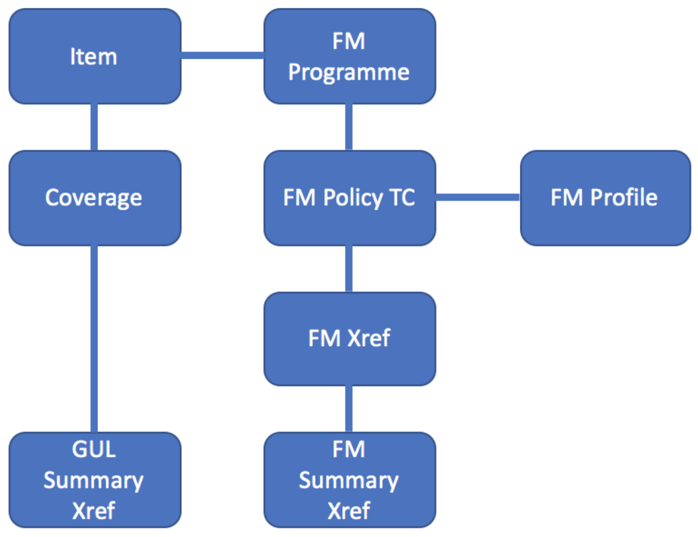

Oasis File Formats
==================

On this page
------------

* :ref:`exposures_file_formats`
* :ref:`FM_file_formats`
* :ref:`summary_level_file_formats`
* :ref:`together_file_formats`

|

.. _exposures_file_formats:

Exposures
*********

Exposure data is also represented in an abstracted form in Oasis. The individual exposed coverages are depicted as integer 
**“items”** where an item is a location, peril, coverage type combination. Item is the lowest level of exposure representation 
in Oasis terminology. Each item will have an areaperil_id to represent its position in the geography of the model and a 
vulnerability_id to identify the type of exposure that it is. The item file also includes a “group_id” field which is used 
for correlation across items in the oasis calculation. Items with the same group_id will be subject to the same random 
number when sampling the effective damage distribution during the simulation calculation.

One or many items can form a **“coverage”** which is a location, coverage-type combination in Oasis terms. The total insured 
value (TIV) is stored at this level in the data representation of exposure against the **“coverage_id”**.

|

|

|

.. _FM_file_formats:

Financial Module
****************

Financial terms and conditions are also represented in an abstracted manner in Oasis using three main files:

* FM Programme which describes the hierarchical aggregation of financial structures

* FM Profile which describes the calculation rules and the values to be used

* FM Policy TC which connects the hierarchical aggregation structure to the profile and also describes any insurance layer 
  conditions

The final file in the Financial Module is the FM Xref which is used to connect the 3 core financial module files to the 
output summary files (see later).

|

|

The FM structure is required to be hierarchical through levels until the final level, at which point a layer structure can 
be implemented, so that a single insurance contract can be applied over many layer applications. It is not possible to have 
lower levels split out to higher levels, they must aggregate through the levels.

|

|

|

.. _summary_level_file_formats:

Summary Level Files
*******************

Finally, there are two files that define how any outputs are aggregated:

* GUL Summary Xref defines how coverage ids should be aggregated in any Ground Up Loss outputs.

* FM Summary Xref defines how FM Output IDs are aggregated in any Insured Loss outputs.

|
.. image:: ../images/file_formats_4.png
   :width: 400
   :align: center
|

|

.. _together_file_formats:

Putting it all together
***********************

The diagram below shows how the different exposure data files should fit together:

|

|