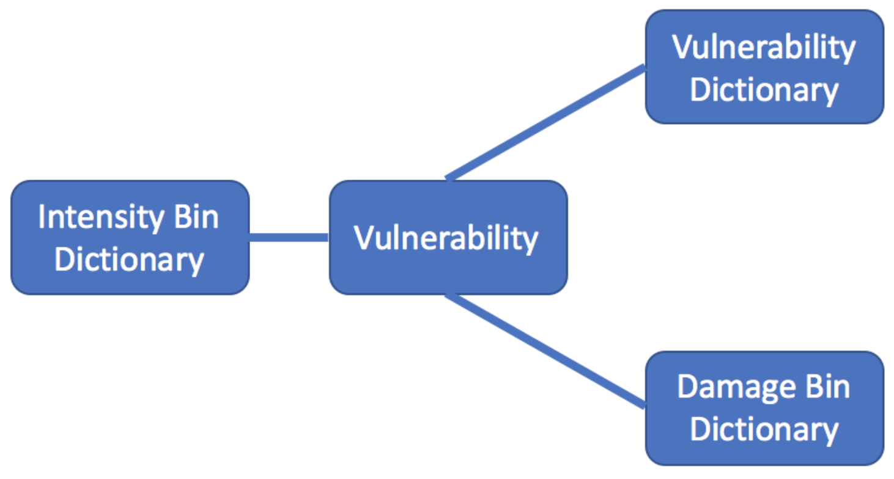
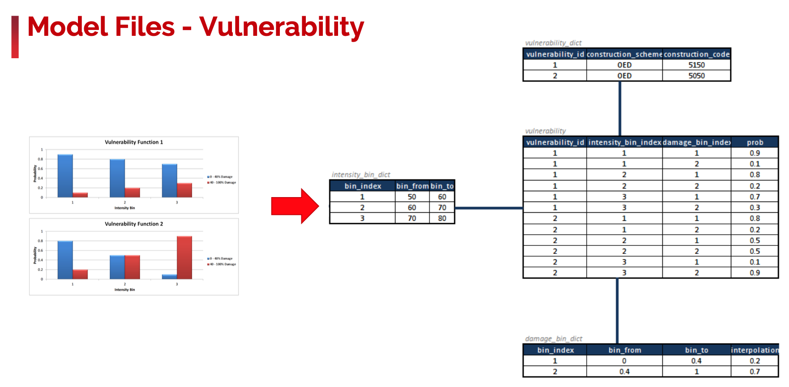

Oasis Model Data Formats
========================

On this page
------------

* :ref:`overview_data_formats`
* :ref:`hazard_data_formats`
* :ref:`vunerability_data_formats`
* :ref:`occurrences_data_formats`
* :ref:`together_data_formats`

|

.. _overview_data_formats:

Overview
********

----

A model in Oasis is made up of a hazard module and a vulnerability module. These modules relate to each other via a common 
intensity metric and relate to exposure data via a set of abstract keys: ``areaperil_id`` and ``vulnerability_id``.

|

.. _hazard_data_formats:

Hazard Module
*************

----

The Hazard Module in Oasis is centered on the Footprint file which describes the interaction of Events with Area- Perils, 
giving a probability distribution of Intensity for each combination.

|

|

The schematic below is an example from the `ParisWindstormModel <https://github.com/OasisLMF/ParisWindstormModel>`_ and shows how 
the hazard module files are mapped:

|

|

The main concepts here are:

* **Area Peril**: This is an abstract representation of an area for a particular peril. The can be anything – i.e. cells in a 
  grid, polygons, variable resolution grids, point values, administrative regions (e.g. postcodes), etc. The ``areaperil_id`` 
  is the key here and needs to be an integer value but what it actually represents doesn’t matter for the Oasis calculation.

* **Event**: Again, this is an abstract representation of an actual event (either synthetic or historic) that affects a 
  number of area-perils. This can be a flood, a windstorm, an earthquake, etc. – it doesn’t make a difference in Oasis terms. 
  Again, the ``event_id`` is the key here and this is simply an integer value that represents that event.

* **Intensity**: The intensity represents a discretised, abstracted set of intensity measures that are specific to the 
  peril (or perils) represented by the events

|

.. _vunerability_data_formats:

Vulnerability Module
********************

----

The Vulnerability Module in Oasis is centered on the **Vulnerability** file which describes the interaction of 
**Intensities** with **Vulnerability types**, giving a probability distribution of **Damage Ratio** for each combination.

|

|

The schematic below shows how the vulnerability module files are mapped in the `ParisWindstormModel 
<https://github.com/OasisLMF/ParisWindstormModel>`_ example:

|

|

The main concepts here are:

* **Intensity**: The intensity represents a discretised, abstracted set of intensity measures that are specific to the peril 
  (or perils) represented by the events

* **Vulnerability Dictionary**: Again, this is an abstract representation of various vulnerability functions. These can be 
  as sophisticated as required for the model. The vulnerability_id is the key here and this is simply an integer value that 
  represents that vulnerability function.

* **Damage**: The Damage represents a discretised, abstracted set of damage ratios.

|

.. _occurrences_data_formats:

Occurrences
***********

----

The final part of the model data definition in Oasis is the Occurrence file. This file details the occurrences of events 
over time and is used in time based outputs such as Average Annual Loss and Loss Exceedance Curves. An optional extension 
to the Occurrence file is the Periods file which allows a weighting to be placed on occurrences.

|

|

.. _together_data_formats:

Putting it all together
***********************

----

Now that we have the hazard module, the vulnerability module and the occurrence definitions, we can put them all together 
across a common intensity bin definition to create a complete representation of a model in Oasis.

|

|

The schematic below shows how the hazard module files and the vulnerability module files are connected together.

|

|

It should be noted that some of these files are not required for the oasis calculation and are simply in place to provide a 
reference to what the abstracted ids mean in reality. The complete picture with required files looks like this:

|

|
