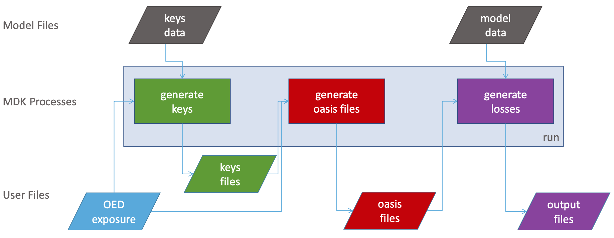

Oasis Workflow
==============

On this page
------------

* :ref:`MDK_Workflow`
* :ref:`API_Workflow`

|

.. _MDK_Workflow:

MDK Workflow
************

----

The schematic below shows the Oasis :doc:`model-development-kit` workflow:

|

|

.. _API_Workflow:

API Workflow
************

----

The general workflow for the Oasis :doc:`API` is as follows:

* Create a portfolio (post to ``/portfolios/``).

* Add a locations file to the portfolio (post to ``/portfolios/<id>/locations_file/``)

* Create the model object for your model (post to ``/models/``).

* Create an analysis (post to ``/portfolios/<id>/create_analysis``). This will generate the input files for the analysis.

* Add analysis settings file to the analysis (post to ``/analyses/<pk>/analysis_settings/``).

* Run the analysis (post to ``/analyses/<pk>/run/``)

* Get the outputs (get ``/analyses/<pk>/output_file/``)

|