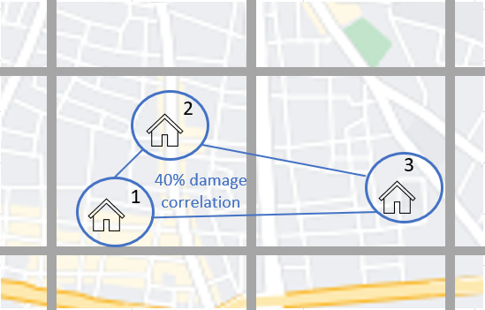

Correlation
==============

On this page
------------

* :ref:`intro_correlation`
* :ref:`sources_of_correlation`
* :ref:`features_by_version`
* :ref:`available_1.15_correlation`
* :ref:`available_1.27_correlation`
* :ref:`available_1.28_correlation`

|
.. _intro_correlation:

Introduction
************

----

This section covers the options in Oasis for modelling correlation in secondary uncertainty, or correlation in the modelled severity of loss given
an event. 

Correlation can be modelled at a very detailed level in Oasis. A rule may be specified for correlating loss between the individual coverages of each site for each hazard that impacts them within the context of a single event. The correlated ground up losses are aggregated as they are passed through the financial terms so that all of the downstream financial perspectives capture this correlation.

The methods of correlating losses can vary by model depending on which of the features are used. Users can also control correlation settings for their portfolio.

|

.. _sources_of_correlation:

Sources of correlation
**********************

----

In large catastrophes, there is a tendency for losses across multiple locations to be correlated, meaning relatively high losses across locations or low losses across locations tend to occur together. The correlation is stronger the closer together the exposures are located. 

Two main reasons why this would be the case for buildings situated close together are;

*   They experience similar a hazard intensity in an event; flood depth, windspeed etc.
*   They have similar vulnerability characteristics (such as being built by the same developer) and similar modes of failure/types of damage given the hazard intensity.

Correlation increases the range of potential claims at a portfolio level and particularly for large, rare events, a model can significantly underestimate uncertainty and extreme losses if this correlation is not captured. It is therefore desirable to allow modellers and users the ability to express views on the degree of spatial correlation in Oasis so that the effect on portfolio risk can be explored.

|

.. _features_by_version:

Correlation features by version
*******************************

----

There are several options in Oasis to represent correlation, and more features have been added in the more recent oasislmf package versions.

These can be summarized as follows;

*  1.15 and later 
    *   Group correlation for damage
    *   Model specification of correlation groups
    *   User override using CorrelationGroup field in OED
    *   User override using an OED field list parameter
*  1.27 and later
    *   Changes to correlation settings
    *   Peril correlation groups
    *   Partial correlation for damage
*  1.28 and later
    *   Separate hazard and damage sampling
    *   Group correlation for hazard intensity
    *   Partial correlation for hazard intensity
    *   Correlation groups for disaggregated risks
|

.. _available_1.15_correlation:

Available in OasisLMF 1.15
##########################

----

**Group correlation for damage**

In Oasis, each row in the input location file representing an exposure location is assigned a ‘group_id’ which is its correlation group.  

•   When exposure locations have the same group_id, damage will be sampled with full correlation. 
•   When exposure locations have different group_ids, damage will be sampled independently.  

To find out how the correlated and independent sampling works, please see the :doc:`Sampling Methodology <sampling-methodology>` section.

The three illustrated exposure locations have different group_ids assigned and would all be sampled independently.

**Three exposures with independent correlation groups**

.. image:: ../images/correlation1.png
   :width: 600

|

**Default settings**

Each exposure location in the OED location file is assigned a unique group_id.  This is the system default behaviour for all models.

The group_id is generated automatically based on unique values of the input OED location fields that uniquely define a location, as illustrated in the table.  

.. csv-table::
    :header: "PortNumber", "AccNumber", "LocNumber"

    "Port1", "Acc1", "Loc1"
    "Port1", "Acc1", "Loc2"
    "Port1", "Acc1", "Loc3"

Multiple coverages at each location will be damaged with full correlation, because the group_id is defined at the location level and is the same value for all coverages.

**Model specification of correlation groups**

The model provider can optionally specify a rule for setting the group_id for a particular model in the model_settings json.  These are called the **data settings**.

The setting illustrated below is equivalent to the system default: that group_ids are assigned based on unique locations defined by the OED fields.

|

``Model_settings.json``

.. code-block:: JSON

    {
        "data_settings": {
        "group_fields": ["PortNumber", "AccNumber", "LocNumber"]
        }
    }

A modeller can use other OED fields to define the groups, and/or internal Oasis fields such as the areaperil_id.

``Model_settings.json``

.. code-block:: JSON

    {
        "data_settings": {
        "group_fields": ["areaperil_id"]
        }
    }

This data setting would result in all locations with the same areaperil_id (located in the same hazard model grid cell) being assigned the same group_id.

The two locations in the cell on the left would be assigned the same group_id and damaged with full correlation, but the location in the cell on the right would be sampled independently from locations in every other model cell.

**Correlation groups assigned by model cell**

.. image:: ../images/correlation2.png
   :width: 600

|

The modeller can combine OED fields with internal Oasis fields.  In the next example, the inclusion of the 'coverage_type_id' field means that not only will locations be damaged independently, but all coverages at a location will be damaged independently.

``Model_settings.json``

.. code-block:: JSON

    {
        "data_settings": {
        "group_fields": ["PortNumber", "AccNumber", "LocNumber","coverage_type_id"]
        }
    }

**User override using CorrelationGroup field in OED**

The user can specify the correlation group directly for each location in the input OED file.

.. csv-table::
    :header: "PortNumber", "AccNumber", "LocNumber", "CorrelationGroup"

    "Port1", "Acc1", "Loc1", "1"
    "Port1", "Acc1", "Loc2", "1"
    "Port1", "Acc1", "Loc3", "2"
    "Port1", "Acc1", "Loc4", "2"

This will override the system default behaviour for generating the group_id, and the rule provided in the data settings for the model, if specified.

**Correlation groups assigned by CorrelationGroup field**

.. image:: ../images/correlation3.png
   :width: 600

|

**User override using OED field list parameter**

Rather than specifying each correlation group_id location by location, the user can instead specify a field list to generate the correlation groups.  This can be any combination of OED location file fields.  Each unique set of values for the specified fields will be assigned a unique group_id.

For instance, if "PostalCode" was chosen as the grouping field, then the group_ids might be assigned as follows.  Locations 3 and 4 are located in the same postcode, and they would be assigned the same group_id.

.. csv-table::
    :header: "PortNumber", "AccNumber", "LocNumber", "PostalCode", "group_id"

    "Port1", "Acc1", "Loc1", "SR3 5LX","1"
    "Port1", "Acc1", "Loc2", "SR3 5LY", "2"
    "Port1", "Acc1", "Loc3", "SR3 5LZ", "3"
    "Port1", "Acc1", "Loc4", "SR3 5LZ", "3"

The OED field list can be specified in the oasislmf settings using the **group_id_cols** parameter, as follows;

``oasislmf.json``

.. code-block:: JSON

    {
        "group_id_cols": ["PostalCode"]
    }

.. _available_1.27_correlation:

Available in OasisLMF 1.27
##########################

----

New correlation features were introduced in OasisLMF 1.27 in 2022.  This meant changes to the **group_fields** parameter of data settings in the model settings json file and the oasislmf **group_id_col** override parameter, and an alternative ground up loss sampling option **gulmc**.  

Although gulmc is introduced in OasisLMF 1.27, production use is recommended from OasisLMF 1.28. See :ref:`gulmc-pytools` for further details. The extra correlation features for separate hazard and damage sampling are explained in :ref:`available_1.28_correlation` below.

The correlation functionality described here is available to use for any standard Oasis model. Complex models that use bespoke correlation methodologies can continue to be used as before, or the new functionality could be incorporated within the complex model wrapper by the model provider. 

**Changes to correlation settings**

In data_settings in the model settings json, the **group_fields** parameter in version 1.15 has been changed to **damage_group_fields**. 

Example:

``Model_settings.json``

.. code-block:: JSON

    {
        "data_settings": {
        "damage_group_fields": ["PortNumber", "AccNumber", "LocNumber"]
        }
    }

In the oasislmf settings, the **group_id_cols** parameter has been changed to **damage_group_id_cols**. 

Example:

``oasislmf.json``

.. code-block:: JSON

    {
        "damage_group_id_cols": ["PostalCode"]
    }

**Peril correlation groups**

There can be multiple hazards in an event which can give rise to damage, and loss. There may be the same peril type, for example flooding from different sources such as river flood / heavy rainfall, or there may be completely different perils and types of damage (e.g. high wind speeds causing roof damage, and flooding causing ground floor damage). 

In previous versions of Oasis, all peril damage at a location has been treated as fully correlated. 

There are now two options; model developers can group the same peril types together to fully correlate them at a location, or independently sample damage from different peril types (e.g. wind and flood). 

A peril correlation group integer can be specified in the lookup settings of the model settings file. This is done for each single peril code used by the model. If peril codes are assigned the same peril correlation group, it means that damage will be fully correlated for those peril codes at each location.   

Here is an example of independent peril damage at each exposure location for a model using two single peril codes;

|

``Model_settings.json``

.. code-block:: JSON

    {
        "lookup_settings":{
            "supported_perils":[
               {"id": "WSS", "desc": "Single Peril: Storm Surge", "peril_correlation_group": 1},
               {"id": "WTC", "desc": "Single Peril: Tropical Cyclone", "peril_correlation_group": 2},
               {"id": "WW1", "desc": "Group Peril: Windstorm with storm surge"},
               {"id": "WW2", "desc": "Group Peril: Windstorm w/o storm surge"}]
        }
    }

The second example groups two single peril codes together in one peril correlation group, meaning that damage will be fully correlated at each exposure location.

``Model_settings.json``

.. code-block:: JSON

    {
        "lookup_settings":{
            "supported_perils":[
               {"id": "ORF", "desc": "Single Peril: Fluvial Flood", "peril_correlation_group": 1},
               {"id": "OSF", "desc": "Single Peril: Pluvial Flood", "peril_correlation_group": 1},
               {"id": "OO1", "desc": "Group Peril: All Flood perils"}
            ]
        }
    }

This feature only defines whether peril damage is correlated or independent at each exposure location, and the behaviour is the same for all locations.  

Correlation in damage *between* locations is still governed by the group correlation feature of OasisLMF 1.15. If different exposure locations share the same group_id locations, then the damage will be 100% correlated, for each peril correlation group.  

|

**Partial damage correlation**

In addition to the damage group feature, a partial damage correlation feature has been introduced to OasisLMF 1.27 to enable a finer degree of control of damage correlation across locations. Peril correlation groups as described above must be defined to use this feature.

A global damage correlation factor can be optionally specified by the model provider to define how damage should be correlated *across* damage groups for each event.  One factor may be specified for each peril correlation group.  This enables correlation in damage for perils that occur in the same event but have different spatial variability in hazard intensity to be specified separately.

The global correlation factor is a number between 0 and 1, where 0 means no correlation and 1 means 100% correlation.  The higher the correlation factor, the greater the tendancy that damage will be consistently low or high across the portfolio with each sample.  When losses are summed to the portfolio level, this leads to a wider range of loss outcomes for the portfolio, per event, and greater extreme losses.

The correlation factor works together with the group correlation functionality. Locations with the same group_id will still have 100% damage correlation, but locations with different group_ids will have partially correlated damage rather than fully independent damage.  

This means that the decision of how group_ids are assigned in model settings and the global correlation factor must be made together by the model provider.

|

**Partial damage correlation of 40% between all locations**

|

The correlation factor is specified in a new **correlation_settings** section of the model settings file.

The example illustrated above would be specified using: 

*   data settings to specify how locations should be grouped
*   lookup settings to specify the peril correlation group (single peril in this case), and 
*   correlation settings to specify the global damage correlation factor

|

``Model_settings.json``

.. code-block:: JSON

    {
        "data_settings": {
        "damage_group_fields": ["PortNumber", "AccNumber", "LocNumber"]
        },

        "lookup_settings":{
            "supported_perils":[
               {"id": "OSF", "desc": "Single Peril: Pluvial Flood", "peril_correlation_group": 1}
            ]
        },

        "correlation_settings": [
              {"peril_correlation_group":  1, "damage_correlation_value":  "0.4"}
            ]
    }

In this example, each exposure location will receive a unique damage group_id, and all exposure locations will be damaged with 40% correlation for each sample, for every event. 

|

.. _available_1.28_correlation:

Available in OasisLMF 1.28
##########################

----

**Separate hazard and damage sampling**

Under the effective damageability sampling method, which was the only sampling method until OasisLMF 1.27, the damage distribution represents a combination of hazard intensity uncertainty (when present in the hazard footprint) and conditional damage uncertainty.  

When considering correlation of loss between locations, it was thought to be more intuitive to model correlation in these two sources of uncertainty separately. 

An alternative methodology 'full Monte Carlo sampling' has been introduced in OasisLMF 1.27, implemented in the 'gulmc' component of pytools, which is to sample an intensity bin from the hazard uncertainty distribution first, and then to sample damage second. This makes it possible to apply different correlation assumptions for hazard uncertainty (where present) and conditional damage uncertainty. 

For models which do not have hazard uncertainty in the footprint, there is no difference between the effective damage distribution and the conditional damage distribution contained within the vulnerability files, i.e. all uncertainty is damage uncertainty. Therefore there no benefit in using gulmc and it is recommended to continue using the effective damageability method and the group correlation methods for damage as in previous versions. 

gulmc is recommended for production use in OasisLMF 1.28.  It can continue to be used in effective damageability mode for models with no hazard intensity uncertainty with unchanged damage group and correlation settings.  The oasislmf settings for this use case is as follows.

``oasislmf.json``

.. code-block:: JSON

    {
        "gulmc": true,
        "gulmc_effective_damageability": true
    }

For models which have hazard intensity uncertainty in the footprint, gulmc can be used to perform separate sampling of hazard intensity and conditional damage, and also to apply correlation assumptions to the sampling of hazard separately to those applied to conditional damage. The oasislmf settings for this use case is as follows.

``oasislmf.json``

.. code-block:: JSON

    {
        "gulmc": true
    }

**Group correlation for hazard intensity**

Where there is hazard intensity uncertainty in the footprint, the modeller may want to control how hazard intensity is sampled for locations that are spatially close. 

For instance, there may be two locations which belong to the same spatial grid (identified by the modeller's areaperil_id) and which may experience similar hazard intensity. 

The modeller can specify how exposure locations can be grouped for full hazard intensity correlation as well as, but separately from, damage using the **hazard_group_fields** parameter in data settings in the model settings json.  The listed fields determine how hazard group_ids are generated across locations for the sampling of hazard intensity in the full Monte Carlo sampling method. Those locations with the same hazard group_id will have the same hazard intensity bin sampled (100% correlation).

**Example 1**  

``Model_settings.json``

.. code-block:: JSON

    {
        "data_settings": {
        "damage_group_fields": ["PortNumber", "AccNumber", "LocNumber"],
        "hazard_group_fields": ["areaperil_id"]
        }
    }

Exposure locations in the same spatial grid, represented here by areaperil_id, will have the same hazard intensity bin sampled, but conditional damage will be sampled independently.  The coverages at each location will be sampled with 100% correlation for both hazard and conditional damage.

|

**Example 2**  

``Model_settings.json``

.. code-block:: JSON

    {
        "data_settings": {
        "damage_group_fields": ["PortNumber", "AccNumber", "LocNumber", "coverage_type_id"],
        "hazard_group_fields": ["PortNumber", "AccNumber", "LocNumber"]
        }
    }

Each exposure location will have independently sampled hazard intensity. The coverages of an exposure location will have the same hazard intensity bin sampled but will have independently sampled conditional damage.

|

**Example 3**  

``Model_settings.json``

.. code-block:: JSON

    {
        "data_settings": {
        "damage_group_fields": ["PortNumber", "AccNumber", "LocNumber", "coverage_type_id"],
        "hazard_group_fields": ["PortNumber", "AccNumber", "LocNumber"]
        },

        "lookup_settings":{
            "supported_perils":[
               {"id": "OSF", "desc": "Single Peril: Pluvial Flood", "peril_correlation_group": 1}
            ]
        },

        "correlation_settings": [
              {"peril_correlation_group":  1, "damage_correlation_value":  "0.4"}
            ]
    }

With the same damage and hazard group settings as Example 2, we can add a global correlation factor for damage (along with its peril correlation group). Rather than the exposure location coverages damage being sampled independently across the portfolio, all exposure location coverages across the portfolio can be sampled with 40% correlation for damage.

|

**Partial hazard correlation**

In exactly the same way that damage can be sampled with partial correlation across all of the defined damage groups, it is also possible to sample hazard intensity with partial correlation across the defined hazard groups.  This correlates the sampling of hazard intensity of hazard groups across the portfolio when using the full Monte Carlo sampling method.

**Example 4**

``Model_settings.json``

.. code-block:: JSON

    {
        "data_settings": {
        "damage_group_fields": ["PortNumber", "AccNumber", "LocNumber", "coverage_type_id"],
        "hazard_group_fields": ["PortNumber", "AccNumber", "LocNumber"]
        },

        "lookup_settings":{
            "supported_perils":[
               {"id": "OSF", "desc": "Single Peril: Pluvial Flood", "peril_correlation_group": 1}
            ]
        },

        "correlation_settings": [
              {"peril_correlation_group":  1, "damage_correlation_value": 0.4, "hazard_correlation_value": 0.2}
            ]
    }

With the same settings as Example 3 above, we can add a global correlation factor for hazard. Instead of independent hazard intensity sampling between hazard groups (each group being one exposure location) hazard intensity will be sampled with 20% correlation between hazard groups.

|

**Example 5**

For multi-peril models, peril correlation groups can enable the specification of different global correlation factors per peril.  The different peril group ids by peril type in this example make sampled peril hazard intensity and peril damage independent at each exposure location.  

``Model_settings.json``

.. code-block:: JSON

    {
        "data_settings": {
        "damage_group_fields": ["PortNumber", "AccNumber", "LocNumber"],
        "hazard_group_fields": ["PortNumber", "AccNumber", "LocNumber"]
        },

        "lookup_settings":{
            "supported_perils":[
               {"id": "WSS", "desc": "Single Peril: Storm Surge", "peril_correlation_group": 1},
               {"id": "WTC", "desc": "Single Peril: Tropical Cyclone", "peril_correlation_group": 2}
               ]
        },

        "correlation_settings": [
              {"peril_correlation_group":  1, "damage_correlation_value": 0.4, "hazard_correlation_value": 0},
              {"peril_correlation_group":  2, "damage_correlation_value": 0.4, "hazard_correlation_value": 0.2}
            ]
    }

With these settings, damage and hazard groups are the same, representing each exposure location. There is no hazard intensity correlation between locations for Storm Surge, and 20% hazard intensity correlation for wind intensity across all locations. Conditional damage correlation is 40% across all locations separately for either peril type (but can have different correlation factors too). 

|

**Correlation groups for disaggregated risks**

OasisLMF 1.28 supports disaggregation of exposure locations when the **NumberOfBuildings** value is greater than 1. This means that one exposure location is split into multiple locations for the purposes of ground up loss sampling and financial module calculations.

The default behaviour is that disaggregated risks will be fully correlated for both hazard and damage if not otherwise specified in model settings using the internal Oasis fields **building_id** or **risk_id** in data settings.

|

**Default correlation group settings**

``Model_settings.json``

.. code-block:: JSON

    {
        "data_settings": {
        "damage_group_fields": ["PortNumber", "AccNumber", "LocNumber"],
        "hazard_group_fields": ["PortNumber", "AccNumber", "LocNumber"]
        },

The fields building_id or risk_id, in addition to 'PortNumber, AccNumber, LocNumber' may be used to make disaggregated risks uncorrelated for either damage, or hazard, or both.

* building_id is a index counter of disaggregated risks for each original location, regardless if the original location represents aggregate data (IsAggregate=1) or a multi-building single location (IsAggregate=0).  Adding building_id to data settings will result in uncorrelated disaggregated risks in both cases.

* risk_id takes the same value as building_id for aggregate risks (IsAggregate=1) but is different for multi-building single locations (IsAggregate=0) where it takes the value of 1. Adding risk_id to data settings will result in uncorrelated disaggregated risks for the IsAggregate=1 case, but fully correlated disaggregated risks for the IsAggregate=0 case.

Some usage examples in model_settings are given below;

|

**Example 1**

Uncorrelated damage for disaggregated risks in all cases:

``Model_settings.json``

.. code-block:: JSON

    {
        "data_settings": {
        "damage_group_fields": ["PortNumber", "AccNumber", "LocNumber","building_id"]
        },

|

**Example 2**

Uncorrelated damage for aggregate risks, fully correlated damage for multi-building single locations:

``Model_settings.json``

.. code-block:: JSON

    {
        "data_settings": {
        "damage_group_fields": ["PortNumber", "AccNumber", "LocNumber","risk_id"]
        },

|

**Example 3**

Correlation in hazard intensity is not applicable for many models and in these cases does not need to be specified. When it is modelled, however, it may be specified differently to damage. 

Uncorrelated hazard in all cases, fully correlated damage for multi-building single locations:

``Model_settings.json``

.. code-block:: JSON

    {
        "data_settings": {
        "damage_group_fields": ["PortNumber", "AccNumber", "LocNumber","risk_id"],
        "hazard_group_fields": ["PortNumber", "AccNumber", "LocNumber","building_id"]
        },

|

**Example 4**

If correlation factors are also specified in correlation_settings, then partial correlation is applied to the uncorrelated disaggregated risks in the same way as it does between locations.

20% partially correlated damage for disaggregated risks in all cases:

``Model_settings.json``

.. code-block:: JSON

    {
        "data_settings": {
        "damage_group_fields": ["PortNumber", "AccNumber", "LocNumber","building_id"]
        },

        "correlation_settings": [
              {"peril_correlation_group":  1, "damage_correlation_value": 0.2, "hazard_correlation_value": 0}
            ]

For more information about disaggregation functionality, please see :doc:`Disaggregation <disaggregation>`.