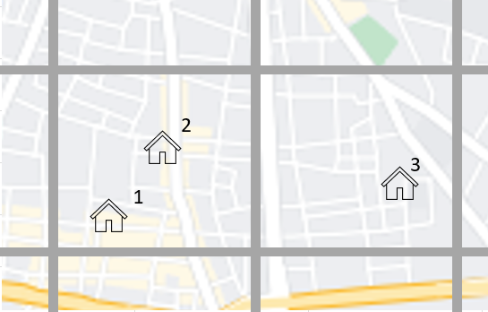
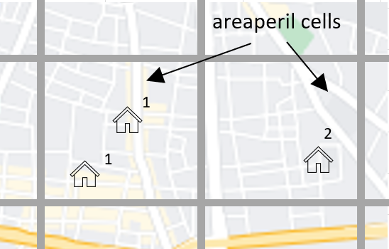

Correlation
==============

On this page
------------

* :ref:`intro_correlation`
* :ref:`sources_of_correlation`
* :ref:`features_by_version`
* :ref:`features_1.15.x`
* :ref:`features_1.15.5`
* :ref:`features_1.27.0`
* :ref:`features_1.27.2`

|
.. _intro_correlation:

Introduction
************

----

This section covers the options in Oasis for modelling correlation in secondary uncertainty, or correlation in the modelled severity of loss given
an event. 

Correlation is modelled at the most detailed level in Oasis for all models.  The correlated ground up losses are aggregated as they are passed through the financial terms so that all of the downstream financial perspective capture this correlation.

The methods of correlating losses can vary by model depending on which of the features are used. Users can also control correlation settings for their portfolio.

|

.. _sources_of_correlation:

Sources of correlation
**********************

----

There is correlation in the hazard intensity that multiple exposures will experience. The closer they are to each other, the more likely it is that they will experience similar hazard intensities.  The relationship between the distance between exposures and the level of hazard correlation will depend on the peril being modelled.  Catastrophe modellers define the geographical resolution of area in their footprint carefully in order to represent the spatial variability of hazard intensity for the peril.

A second source of correlation is in the level of damage given the force of hazard intensity. This arises because of buildings that are close to each other of similar construction can have the same vulnerabilities to damage.

The combination of hazard intensity and damage correlation leads to more extreme losses across a portfolio which is of primary concern to a risk carrier.  It does not change the mean ground up loss, but leads to more extreme losses at higher return periods. 

|

.. _features_by_version:

Correlation features by version
*******************************

----

There are several options in Oasis to represent correlation, and more features have been added in the more recent oasislmf package versions.

These can be summarized as follows;

*  1.15.x and later 
    *   Group correlation for damage
    *   Model specification of correlation groups
    *   User override using CorrelationGroup field in OED
*  1.15.5 and later
    *   User override using an OED field list
*   1.27.0 and later
    *   Separate hazard and damage sampling (full monte carlo sampling). 
    *   Partial correlation for damage. 
    *   Separate groupings for hazard correlation.  
*   1.27.2 and later
    *   Partial correlation for hazard

|

.. _features_1.15.x:

Features in OasisLMF 1.15x
##########################

----

**Group correlation for damage**

In Oasis, each exposure at risk is assigned a number ‘group_id’ which is its correlation group.  

•   When exposures have the same group_id, damage will be sampled with full correlation. 
•   When exposures have different group_ids, damage will be sampled independently.  

To find out how the correlated and independent sampling works, please see the ‘calculation’ section.

The three illustrated exposures have different group_ids assigned and would all be sampled independently.

**Three exposures with different correlation groups assigned**

|

Each location in the OED location file is assigned a unique group_id.  This is the system default behaviour for all models.

The group_id is indexed based on unique values of the input OED location fields that uniquely define a location, as illustrated below.  

.. csv-table::
    :header: "PortNumber", "AccNumber", "LocNumber"

    "Port1", "Acc1", "Loc1"
    "Port1", "Acc1", "Loc2"
    "Port1", "Acc1", "Loc3"

Under this setting, multiple coverages at each location will be damaged with full correlation, because the group_id is defined at the site level.

**Model specification of correlation groups**

The model provider can optionally specify a rule for setting the group_id for a particular model in the model_settings json.  These are called the data settings.

The setting illustrated below is equivalent to the system default: that group_ids are assigned based on unique locations defined by the OED fields.

|

``Model_settings.json``

.. code-block:: JSON

    "data_settings": {
    "damage_group_fields": ["PortNumber", "AccNumber", "LocNumber"] }
    }
|

A modeller can use other OED fields to define the groups, and/or internal Oasis fields such as the areaperil_id.

``Model_settings.json``

.. code-block:: JSON

    "data_settings": {
    "damage_group_fields": ["areaperil_id"] }
    }

|

This data setting would result in all locations with the same areaperil_id (located in the same hazard model grid cell) being assigned the same group_id.

The two locations in the cell on the left would be assigned the same group_id and damaged with full correlation, but the location in the cell on the right would be sampled independently from every other model cell.

**Correlation groups assigned by model cell**

|

The modeller can combine OED fields with internal Oasis fields.  In this example, the inclusion of the 'coverage_type_id' field means that not only will locations be damaged independently, but all coverages at a location will be damaged independently.

``Model_settings.json``

.. code-block:: JSON

    "data_settings": {
    "damage_group_fields": ["PortNumber", "AccNumber", "LocNumber","coverage_type_id"] }
    }

|

.. _features_1.15.5:

Features in OasisLMF 1.15.5
###########################

----

.. _features_1.27.x:

Features in OasisLMF 1.27.x
###########################

----

.. _features_1.27.2:

Features in OasisLMF 1.27.2
###########################

----