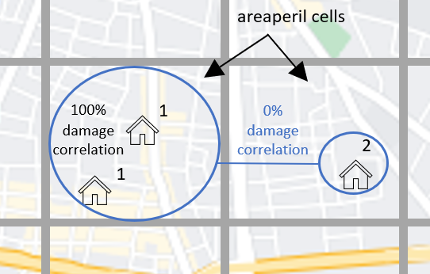

Correlation
==============

On this page
------------

* :ref:`intro_correlation`
* :ref:`sources_of_correlation`
* :ref:`features_by_version`
* :ref:`available_1.15`
* :ref:`available_1.27`

|
.. _intro_correlation:

Introduction
************

----

This section covers the options in Oasis for modelling correlation in secondary uncertainty, or correlation in the modelled severity of loss given
an event. 

Correlation is modelled at the most detailed level in Oasis for all models.  The correlated ground up losses are aggregated as they are passed through the financial terms so that all of the downstream financial perspectives capture this correlation.

The methods of correlating losses can vary by model depending on which of the features are used. Users can also control correlation settings for their portfolio.

|

.. _sources_of_correlation:

Sources of correlation
**********************

----

In large catastrophes, there is a tendency for losses across multiple locations to be correlated, meaning relatively high losses across locations or low losses across locations tend to occur together. The correlation is stronger the closer together the exposures are located. 

Two main reasons why this would be the case for buildings situated close together are;

*   They experience similar a hazard intensity in an event; flood depth, windspeed etc.
*   They have similar vulnerability characteristics (such as being built by the same developer) and similar modes of failure/types of damage given the hazard intensity.

Correlation increases the range of potential claims at a portfolio level and particularly for large, rare events, a model can significantly underestimate uncertainty and extreme losses if this correlation is not captured. It is therefore desirable to allow modellers and users the ability to express views on the degree of spatial correlation in Oasis so that the effect on portfolio risk can be explored.

|

.. _features_by_version:

Correlation features by version
*******************************

----

There are several options in Oasis to represent correlation, and more features have been added in the more recent oasislmf package versions.

These can be summarized as follows;

*  1.15 and later 
    *   Group correlation for damage
    *   Model specification of correlation groups
    *   User override using CorrelationGroup field in OED
    *   User override using an OED field list parameter
*  1.27 and later
    *   Separate hazard and damage sampling (full monte carlo sampling). 
    *   Partial correlation for damage. 
    *   Separate groupings for hazard correlation.  
    *   Partial correlation for hazard

|

.. _available_1.15:

Available in OasisLMF 1.15
##########################

----

**Group correlation for damage**

In Oasis, each exposure at risk is assigned a ‘group_id’ which is its correlation group.  

•   When exposures have the same group_id, damage will be sampled with full correlation. 
•   When exposures have different group_ids, damage will be sampled independently.  

To find out how the correlated and independent sampling works, please see the ‘calculation’ section.

The three illustrated exposures have different group_ids assigned and would all be sampled independently.

**Three exposures with independent correlation groups**

.. image:: ../images/correlation1.png
   :width: 600

|

Each location in the OED location file is assigned a unique group_id.  This is the system default behaviour for all models.

The group_id is generated automatically based on unique values of the input OED location fields that uniquely define a location, as illustrated in the table.  

.. csv-table::
    :header: "PortNumber", "AccNumber", "LocNumber"

    "Port1", "Acc1", "Loc1"
    "Port1", "Acc1", "Loc2"
    "Port1", "Acc1", "Loc3"

Under this setting, multiple coverages at each location will be damaged with full correlation, because the group_id is defined at the location level.

**Model specification of correlation groups**

The model provider can optionally specify a rule for setting the group_id for a particular model in the model_settings json.  These are called the data settings.

The setting illustrated below is equivalent to the system default: that group_ids are assigned based on unique locations defined by the OED fields.

|

``Model_settings.json``

.. code-block:: JSON

    "data_settings": {
    "group_fields": ["PortNumber", "AccNumber", "LocNumber"] }
    }
|

A modeller can use other OED fields to define the groups, and/or internal Oasis fields such as the areaperil_id.

``Model_settings.json``

.. code-block:: JSON

    "data_settings": {
    "group_fields": ["areaperil_id"] }
    }

|

This data setting would result in all locations with the same areaperil_id (located in the same hazard model grid cell) being assigned the same group_id.

The two locations in the cell on the left would be assigned the same group_id and damaged with full correlation, but the location in the cell on the right would be sampled independently from every other model cell.

**Correlation groups assigned by model cell**

|

The modeller can combine OED fields with internal Oasis fields.  In the next example, the inclusion of the 'coverage_type_id' field means that not only will locations be damaged independently, but all coverages at a location will be damaged independently.

``Model_settings.json``

.. code-block:: JSON

    "data_settings": {
    "group_fields": ["PortNumber", "AccNumber", "LocNumber","coverage_type_id"] }
    }

|

**User override using CorrelationGroup field in OED**

The user can specify the correlation group directly for each location in the input OED file.

.. csv-table::
    :header: "PortNumber", "AccNumber", "LocNumber", "CorrelationGroup"

    "Port1", "Acc1", "Loc1", "1"
    "Port1", "Acc1", "Loc2", "1"
    "Port1", "Acc1", "Loc3", "2"
    "Port1", "Acc1", "Loc4", "2"

This will override the system default behaviour for generating the group_id, and the rule provided in the data settings for the model, if specified.

**Correlation groups assigned by CorrelationGroup field**

.. image:: ../images/correlation3.png
   :width: 600

|

**User override using OED field list parameter**

Rather than specifying each correlation group_id location by location, the user can instead specify a field list to generate the correlation groups.  This can be any combination of OED location fields.  Each unique set of values for the specified fields will be assigned a unique group_id.

For instance, if "PostalCode" was chosen as the grouping field, then the group_ids might be assigned as follows.  Locations 3 and 4 are located in the same postcode, and they would be assigned the same group_id.

.. csv-table::
    :header: "PortNumber", "AccNumber", "LocNumber", "PostalCode", "group_id"

    "Port1", "Acc1", "Loc1", "SR3 5LX","1"
    "Port1", "Acc1", "Loc2", "SR3 5LY", "2"
    "Port1", "Acc1", "Loc3", "SR3 5LZ", "3"
    "Port1", "Acc1", "Loc4", "SR3 5LZ", "3"

The OED field list can be specified in the oasislmf settings using the **group_id_cols** parameter, as follows;

``oasislmf.json``

.. code-block:: JSON

   {
    "group_id_cols": ["PostalCode"]
    }

|

.. _available_1.27:

Available in OasisLMF 1.27
#########################

----

