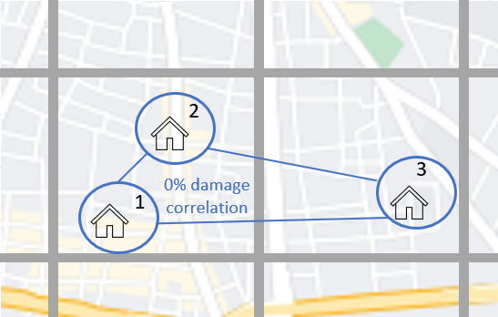

Correlation
==============

On this page
------------

* :ref:`intro_correlation`
* :ref:`sources_of_correlation`
* :ref:`features_by_version`
* :ref:`available_1.15`
* :ref:`available_1.27`

|
.. _intro_correlation:

Introduction
************

----

This section covers the options in Oasis for modelling correlation in secondary uncertainty, or correlation in the modelled severity of loss given
an event. 

Correlation can be modelled at a very detailed level in Oasis. A rule may be specified for correlating loss between the individual coverages of each site for each hazard that impacts them within the context of a single event. The correlated ground up losses are aggregated as they are passed through the financial terms so that all of the downstream financial perspectives capture this correlation.

The methods of correlating losses can vary by model depending on which of the features are used. Users can also control correlation settings for their portfolio.

|

.. _sources_of_correlation:

Sources of correlation
**********************

----

In large catastrophes, there is a tendency for losses across multiple locations to be correlated, meaning relatively high losses across locations or low losses across locations tend to occur together. The correlation is stronger the closer together the exposures are located. 

Two main reasons why this would be the case for buildings situated close together are;

*   They experience similar a hazard intensity in an event; flood depth, windspeed etc.
*   They have similar vulnerability characteristics (such as being built by the same developer) and similar modes of failure/types of damage given the hazard intensity.

Correlation increases the range of potential claims at a portfolio level and particularly for large, rare events, a model can significantly underestimate uncertainty and extreme losses if this correlation is not captured. It is therefore desirable to allow modellers and users the ability to express views on the degree of spatial correlation in Oasis so that the effect on portfolio risk can be explored.

|

.. _features_by_version:

Correlation features by version
*******************************

----

There are several options in Oasis to represent correlation, and more features have been added in the more recent oasislmf package versions.

These can be summarized as follows;

*  1.15 and later 
    *   Group correlation for damage
    *   Model specification of correlation groups
    *   User override using CorrelationGroup field in OED
    *   User override using an OED field list parameter
*  1.27 and later
    *   Peril correlation groups
    *   Partial correlation for damage
    *   Separate groupings for hazard correlation
    *   Separate hazard and damage sampling (full monte carlo sampling). 
    *   Partial correlation for hazard

|

.. _available_1.15:

Available in OasisLMF 1.15
##########################

----

**Group correlation for damage**

In Oasis, each exposure at risk is assigned a ‘group_id’ which is its correlation group.  

•   When exposures have the same group_id, damage will be sampled with full correlation. 
•   When exposures have different group_ids, damage will be sampled independently.  

To find out how the correlated and independent sampling works, please see the Sampling Methodology section.

The three illustrated exposures have different group_ids assigned and would all be sampled independently.

**Three exposures with independent correlation groups**

|

Note that the locations illustrated may be impacted by the same or similar hazard intensity values per event, depending on the model's footprint. Where there is a single intensity value per model cell in the footprint (this is generally the case), it is only the correlation in damage given the hazard intensity that is being specified using the group_id. 

**Default settings**

Each location in the OED location file is assigned a unique group_id.  This is the system default behaviour for all models.

The group_id is generated automatically based on unique values of the input OED location fields that uniquely define a location, as illustrated in the table.  

.. csv-table::
    :header: "PortNumber", "AccNumber", "LocNumber"

    "Port1", "Acc1", "Loc1"
    "Port1", "Acc1", "Loc2"
    "Port1", "Acc1", "Loc3"

Multiple coverages at each location will be damaged with full correlation, because the group_id is defined at the location level and is the same number for all coverages.

**Model specification of correlation groups**

The model provider can optionally specify a rule for setting the group_id for a particular model in the model_settings json.  These are called the data settings.

The setting illustrated below is equivalent to the system default: that group_ids are assigned based on unique locations defined by the OED fields.

|

``Model_settings.json``

.. code-block:: JSON

    "data_settings": {
    "group_fields": ["PortNumber", "AccNumber", "LocNumber"] }
    }
|

A modeller can use other OED fields to define the groups, and/or internal Oasis fields such as the areaperil_id.

``Model_settings.json``

.. code-block:: JSON

    "data_settings": {
    "group_fields": ["areaperil_id"] }
    }

|

This data setting would result in all locations with the same areaperil_id (located in the same hazard model grid cell) being assigned the same group_id.

The two locations in the cell on the left would be assigned the same group_id and damaged with full correlation, but the location in the cell on the right would be sampled independently from locations in every other model cell.

**Correlation groups assigned by model cell**

.. image:: ../images/correlation2.png
   :width: 600

|

The modeller can combine OED fields with internal Oasis fields.  In the next example, the inclusion of the 'coverage_type_id' field means that not only will locations be damaged independently, but all coverages at a location will be damaged independently.

``Model_settings.json``

.. code-block:: JSON

    "data_settings": {
    "group_fields": ["PortNumber", "AccNumber", "LocNumber","coverage_type_id"] }
    }

|

**User override using CorrelationGroup field in OED**

The user can specify the correlation group directly for each location in the input OED file.

.. csv-table::
    :header: "PortNumber", "AccNumber", "LocNumber", "CorrelationGroup"

    "Port1", "Acc1", "Loc1", "1"
    "Port1", "Acc1", "Loc2", "1"
    "Port1", "Acc1", "Loc3", "2"
    "Port1", "Acc1", "Loc4", "2"

This will override the system default behaviour for generating the group_id, and the rule provided in the data settings for the model, if specified.

**Correlation groups assigned by CorrelationGroup field**

.. image:: ../images/correlation3.png
   :width: 600

|

**User override using OED field list parameter**

Rather than specifying each correlation group_id location by location, the user can instead specify a field list to generate the correlation groups.  This can be any combination of OED location fields.  Each unique set of values for the specified fields will be assigned a unique group_id.

For instance, if "PostalCode" was chosen as the grouping field, then the group_ids might be assigned as follows.  Locations 3 and 4 are located in the same postcode, and they would be assigned the same group_id.

.. csv-table::
    :header: "PortNumber", "AccNumber", "LocNumber", "PostalCode", "group_id"

    "Port1", "Acc1", "Loc1", "SR3 5LX","1"
    "Port1", "Acc1", "Loc2", "SR3 5LY", "2"
    "Port1", "Acc1", "Loc3", "SR3 5LZ", "3"
    "Port1", "Acc1", "Loc4", "SR3 5LZ", "3"

The OED field list can be specified in the oasislmf settings using the **group_id_cols** parameter, as follows;

``oasislmf.json``

.. code-block:: JSON

   {
    "group_id_cols": ["PostalCode"]
    }

|

.. _available_1.27:

Available in OasisLMF 1.27
##########################

New correlation features were introduced in release 1.27 in 2022.  This meant breaking changes in the format of the model settings file, and an alternative runtime calculation option 'gulmc' which is required for some of the features explained below.  

The correlation functionality described here is available to use for any standard Oasis model. Complex models that use bespoke correlation methodologies can continue to be used as before, or the new functionality could be incorporated within the complex model wrapper by the model provider. 

|

**Peril correlation groups**

There can be multiple hazards in an event which can give rise to loss. There may be the same peril type, for example flooding from different sources such as river flood / heavy rainfall, or there may be completely different perils and types of damage (e.g. high wind speeds causing roof damage, and flooding causing ground floor damage). 

In previous versions of Oasis, all peril damage at a location has been treated as fully correlated. 

There are now two options; model developers can group the same peril types together to fully correlate them at a location, or treat damage from different peril types (e.g. wind and flood) as independent. 

A peril correlation group number (an integer) can be specified in the lookup settings of the model settings file. This is done for each single peril code used by the model. If peril codes are assigned the same peril correlation group, it means that damage will be fully correlated for those peril codes at each location.   

Here is an example of independent peril damage for a model using two single peril codes;

|

``Model_settings.json``

.. code-block:: JSON

    "lookup_settings":{
        "supported_perils":[
           {"id": "WSS", "desc": "Single Peril: Storm Surge", "peril_correlation_group": 1},
           {"id": "WTC", "desc": "Single Peril: Tropical Cyclone", "peril_correlation_group": 2},
           {"id": "WW1", "desc": "Group Peril: Windstorm with storm surge"},
           {"id": "WW2", "desc": "Group Peril: Windstorm w/o storm surge"}
        ]
    },

|

The second example groups two single peril codes together in one peril correlation group, meaning that damage will be fully correlated at a location.

``Model_settings.json``

.. code-block:: JSON

    "lookup_settings":{
        "supported_perils":[
           {"id": "ORF", "desc": "Single Peril: Fluvial Flood", "peril_correlation_group": 1},
           {"id": "OSF", "desc": "Single Peril: Pluvial Flood", "peril_correlation_group": 1},
           {"id": "OO1", "desc": "Group Peril: All Flood perils"}
        ]
    },

|

This feature only defines whether peril damage is correlated or independent at a location, and the behaviour is the same for all locations.  

Correlation in  damage between locations is still governed by the group correlation feature of 1.15. If locations share the same group_id across locations, then the damage will be 100% correlated, for each peril correlation group.  

The partial damage correlation feature described below has been introduced to enable a finer degree of control of damage correlation across locations.

|

**Partial damage correlation**

A global damage correlation factor can be specified by the model provider to define how damage should be correlated across locations for each event.  One factor may be specified for each peril correlation group.  This enables correlation in damage for perils that occur in the same event but have different spatial variability in hazard intensity to be specified separately.

The global correlation factor is a number between 0 and 1, where 0 means no correlation and 1 means 100% correlation.  The higher the correlation factor, the greater the tendancy that damage will be consistently low or high across the portfolio with each sample.  When losses are summed to the portfolio level, this leads to a wider range of loss outcomes for the portfolio, per event, and greater extreme losses.

The correlation factor works together with the group correlation functionality. Locations with the same group_id will still have 100% damage correlation, but locations with different group_ids will have partially correlated damage rather than fully independent damage.  

This means that the decision of how group_ids are assigned and the global correlation factor must be made together by the model provider.

|

**Partial damage correlation of 40% between all locations**

.. image:: ../images/correlation4.png
   :width: 600

|

The correlation factor is specified in a new 'correlation_settings' section of the model settings file.

The example illustrated above would be specified using: 

*   data settings to specify how locations should be grouped
*   lookup settings to specify the peril correlation group (single peril in this case), and 
*   correlation settings to specify the global damage correlation factor

|

``Model_settings.json``

.. code-block:: JSON

    "data_settings": {
    "damage_group_fields": ["PortNumber", "AccNumber", "LocNumber"] }
    },

    "lookup_settings":{
        "supported_perils":[
           {"id": "OSF", "desc": "Single Peril: Pluvial Flood", "peril_correlation_group": 1}
        ]
    },

    "correlation_settings": [
          {"peril_correlation_group":  1, "damage_correlation_value":  "0.4"}
        ]

|

Note there is a breaking change in the data_settings parameter **group_fields** which has been changed to **damage_group_fields** in 1.27.

|

**Separate hazard and damage sampling**

(TO DO)

|

**Separate groupings for hazard correlation**

(TO DO)

|

**Partial hazard correlation**

(TO DO)

|

----

