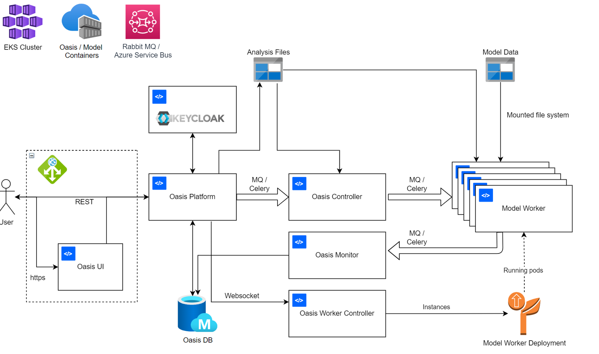

Deployment options
==================

On this page
------------

* :ref:`introduction_deployment`
* :ref:`model_developer_deployment`
* :ref:`single_small_deplyment`
* :ref:`larger_deployment`
* :ref:`any_deployment`

|

.. _introduction_deployment:

Introduction:
*************

----

Models can be built, tested, and ran via four formats that can be assigned based on the type of user you are: 

* :ref:`model_developer_deployment`
* :ref:`single_small_deplyment`
* :ref:`larger_deployment`
* :ref:`any_deployment`

|

.. _model_developer_deployment:

Model developer
***************

----

This user would use the Oasis :doc:`model-development-kit` to create models with the command line. More information on this 
tool can be found in the :doc:`model-development-kit` section.

|

.. _single_small_deplyment:

Single user / smaller company
*****************************

----

A single users / smaller companies are advised to install the **Oasis package** for building, testing, and validating models. 
This is a more traditional approach to model development than the :doc:`MDK <model-development-kit>`; instead of interracting 
with the command line, the platform is accessible via the :doc:`Oasis-UI`, as well as a suite of APIs.

The platform is Docker-based and so can operate on which ever operating system you use: Windows, Max, or Linux. Once 
installed, the package can run models on any scale that you or your company desires; whether that is on a laptop, server, or 
in the cloud. There are walkthough videos for how to download the Oasis platform on YouTube:

|

* Oasis Installation Guide for Windows 10 operating systems

..  youtube:: SxRt5E-Y5Sw

|

* Oasis Installation Guide for Linux based operating systems

..  youtube:: OFLTpGGEM10

|

Once installed, the Oasis plaform can be accessed with via the :doc:`Oasis-UI`. This is a simple and easy to interract with 
user interface that enables a user to import their exposure and financial data before executing a cat model. The results 
produced by the model are based on the user-defined outputs, which are extensively customisable, catering for most user 
requirements. More information on how to use the UI can be found on the :doc:`Oasis-UI` section. This included walkthrough 
YouTube videos on how to use it.

|

.. _larger_deployment:

Larger company
**************

----

For larger companies with more users and more needs in regards to volume of runs (ie. hundreds of analyses per week), we 
advise our **Oasis Enterprise Platform**. This platform uses Google's Kubernetes orchestration engine to distribute workloads 
over many many workers, effectively allowing you to spin up lots of instances and break large jobs up into lots of small 
jobs to run them at scale. This enables analyses to be completed much cheaper and more efficently.

The **Oasis Enterprise Platform** is an open source `Kubernetes <https://kubernetes.io/docs/concepts/overview/>`_ based, 
cloud computing cluster, which is deployable in `Microsoft Azure <https://azure.microsoft.com/en-gb/resources/
cloud-computing-dictionary/what-is-azure/>`_ via `Helm charts <https://helm.sh/docs/topics/charts/>`_ and `Bicep scripts 
<https://learn.microsoft.com/en-us/azure/azure-resource-manager/bicep/deployment-script-bicep>`_ to setup the Azure cloud 
services. The diagram below sets out the **Oasis Enterprise Platform** architecture:

|

|

This platform is something that would be run on a server or in the cloud; it is not suitable for laptop use.

Example implementations of the Oasis Enterprise Platform are availible in Microsoft Azure. More information about this can 
be found in the `OasisAzureDeployment Github repository <https://github.com/OasisLMF/OasisAzureDeployment>`_.

The :doc:`Oasis-UI` is compatible with this system, however, the advised approach is to use the API layer to systematically
integrate this with your existing systems. This will enable you to then pass in exposure data and analysis requirements to 
extract model results.

|

.. _any_deployment:

Any size company
****************

----

The final option is SaaS (Software as a Service), and is availible to any size company. This is a growing number of 
third-party organisations that host and run models on your behalf. These companies offer various commercial services, 
consultancy and full support with running models. Some of these companies also offer custom user interfaces that have 
additonal functionalilty boyond the :doc:`Oasis-UI`, such has the UI hosted by Verisk's Model Exchange platform:

|

.. image:: ../images/ModelExchange_UI.png
    :width: 600
    :align: center
    :alt: Model Exchange UI

|

Companies offering this service include the likes of Verisk Model Exchange, Xceedance, and Impact Forecasting Elements. More 
information about SaaS and the companies can be found in the :doc:`SaaS-providers` section.

