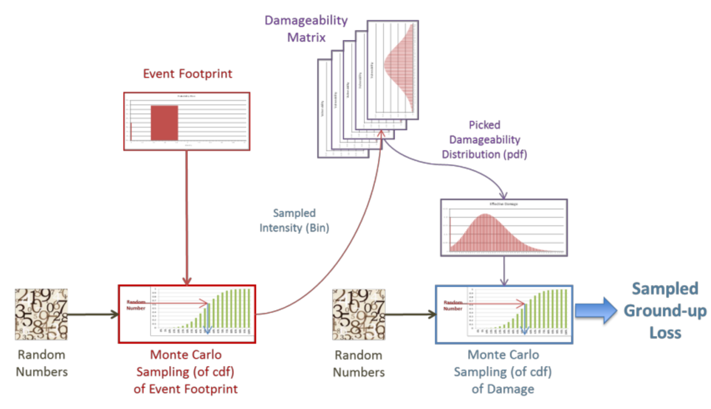

Disaggregation
==============

On this page
------------

* :ref:`intro_disaggregation`
* :ref:`how_it_works_disaggregation`
* :ref:`requirements_disaggregation`
* :ref:`proposals_disaggregation`
* :ref:`related_docs_disaggregation`

|
.. _intro_disaggregation:

Introduction
************

Oasis is a detailed loss modelling platform, meaning that it is most suited to modelling individual buildings with known 
locations and vulnerability attributes. However, exposure data can be aggregated, low resolution or missing key attributes. 
This is particularly true in the developing world - a key focus of the Oasis model library.

Uncertainty about the exposures is not always captured in loss output. In the modelling process we try to find a best match 
of an exposure’s location to the model’s hazard grid (areaperil_id) and a vulnerability function (vulnerability_id) which 
together determine the effective damage distribution per event in the analysis. But other choices of areaperil_id and 
vulnerability_id might be valid and produce a different distribution and therefore different losses. The question is what 
general features can Oasis provide to capture this uncertainty in the modelling process?

|

.. _how_it_works_disaggregation:

How it works
************

Currently in the Oasis platform, as of August 2022, exposure must be converted into detailed data, one building per row in 
the location file, before being imported into the platform for analysis. This can be done outside of the system, or the 
model developer, as part of the Oasis model assets, can provide a pre-analysis routine to generate a modified OED location 
file from an input OED location file which splits aggregate risk records into detailed risk records.

The purpose of pre-analysis routines are to provide flexibility to manipulate the OED input files before the model is run, 
for augmentation as required by the model. An example pre-analysis ‘hook’ for the PiWind model can be found `here 
<https://github.com/OasisLMF/OasisPiWind/blob/master/src/exposure_modification/exposure _pre_analysis_example.py>`_.

If aggregate risks are not split out upon import, then (absent any model specific pre-analysis adjustments) Oasis will 
assume the aggregate risk is a single location and model it as such. This will lead to much wider uncertainty in loss 
results (higher tails in EP curves) than if it was modelled as individual buildings and summed, which would have reduced 
variation due to the ‘portfolio effect’.

The handling of exposure uncertainty is entirely in the hands of the modeller, and therefore there is a varying range of 
support for this type of uncertainty across Oasis models today. Here are some of the different methods for handling exposure 
uncertainty that we are aware of.

|

Handling of location uncertainty - single risk
##############################################

If the geographical location of an exposure known at a lower resolution than the model’s hazard footprint (which typically 
requires street address or latitude-longitude precision) then whether it can be modelled or not depends on the model. Each 
Oasis model will specify a list of geographical fields required for modelling. This could be just the latitude-longitude 
point, or it could be latitude- longitude point and/or postal code, etc, because hazard data is normally provided at a very 
detailed level, depending on the peril in question.

Geocoding may be performed to find the coordinates for the exposure as a pre-import step, but this is unlikely to improve 
the ability of the model to produce reliable risk results. This is because geocoding will typically return the 
latitude-longitude centroid of the administrative zone for the exposure. The exposure will be matched with the closest 
hazard cell in the model to the centroid point and the uncertainty over the exact location of the exposure within the 
administrative zone, along with the chance of it experiencing a range of hazard intensities, is ignored.

A better way to handle location uncertainty, is currently for the modeller to build a set of hazard footprints at the 
resolution that the geographical location is known.

As an example, taking a hypothetical area grid which contains 9 smaller grid cells. Each small grid cell contains a hazard 
intensity value, represented here by bin index 1, 2 or 3. A hazard intensity distribution can be created for the large area 
grid by binning the hazard values of the 9 grid cells.

|

**Uniform binning of intensity to aggregate cell level**

|

This method could be performed for any definition of area, such as administrative zone (irregular boundaries making it 
slightly more complicated).

If information about the built environment is known, a more sophisticated approach is to weight the values according to 
where the buildings are concentrated.
   
|

**Weighted binning of intensity to aggregate cell level**

|

The weighting can further be based on some measure of building density within each small grid. These binned distributions 
can be included in the model hazard footprint as ‘aggregate’ footprints against a different range of areaperil_ids and 
exposures can be matched to these footprints as appropriate.

The relative frequencies are interpreted as probabilities of an exposure experiencing different levels of hazard intensity 
for an event, which proxies the uncertainty of the precise location.

|

Handling of vulnerability attribute uncertainty – single risk
#############################################################

Vulnerability attributes that determine the damage response to a given level of hazard intensity in a vulnerability module 
are typically peril, coverage type, occupancy and/or construction type. There is a long list of other data fields that are 
used as modifiers to the damage response for a general type of building, but very often in exposure data the more detailed 
information is missing, and modellers have to support the minimum set of fields.

To handle this, modellers will often provide vulnerability functions for general residential or commercial lines of business, 
etc. These base functions are independent of location and assume a static mixture of vulnerability functions for the 
supported types (e.g. detached house, 2 storeys, 1960’s build and all the various combinations), often with wider overall 
uncertainty as a result of being a blend of many different distributions.

If information about the built environment is known, then based on where the location is, the modeller can instead blend 
vulnerability functions based on the known mixture of building types in the local area. This can greatly improve the 
modelling of vulnerability compared with the general functions and reduce the modelled uncertainty associated with unknown 
attributes.

Vulnerability modules can have quite small file sizes when the functions are independent of location but adding area-based 
vulnerability curves to an Oasis vulnerability module (e.g. one for every postcode) can make the file size explode. This is 
a bigger issue for the vulnerability module than it is to add aggregate footprints to the hazard module, where the detailed 
footprints are already very big and the increase in file size is relatively smaller.

|

Aggregate exposures with known number of risks
##############################################

Aggregate exposures typically have imprecise geographical and vulnerability attribute information since each row represents 
a collection of buildings, and therefore are subjected to the same single risk cases of uncertainty described above. The 
only option currently is to split out the risks into individual buildings as a pre-analysis step. An additional unknown is 
the individual insured value per building.

|

Example aggregate risk data segmented by line of business in OED format:

.. csv-table::
    :header: "Port Number", "Acc Number", "Loc Number", "NumberOfBuildings", "Occupancy Code", "BuildingTIV", "LocDec6All", "Postal Code"

    "1", "1", "Res1", "56", "1050", "19,600,000", "28,000", "XX54"
    "1", "2", "Com1", "14", "1100", "10,500,000", "35,000", "XX54"

|

A few methods used to disaggregate the aggregate risks into detailed risks are as follows:

**1.** Equal split of TIV by NumberOfBuildings. All ‘sub’-risks have identical geographical and vulnerability characteristics, 
and insured values.

|

.. csv-table::
    :header: "Port Number", "Acc Number", "Loc Number", "NumberOfBuildings", "Occupancy Code", "BuildingTIV", "LocDec6All", "Postal Code"

    "1", "1", "Res1", "1", "1050", "350,000", "500", "XX54"
    "1", "1", "Res2", "1", "1050", "350,000", "500", "XX54"
    "1", "1", "Res3", "1", "1050", "350,000", "500", "XX54"
    "...", "...", "...", "...", "...", "...", "...", "..."
    "1", "1", "Res56", "1", "1050", "350,000", "500", "XX54"
    "1", "2", "Com1", "1", "1100", "750,000", "2,500", "XX54"
    "...", "...", "...", "...", "...", "...", "...", "..."
    "1", "2", "Com13", "1", "1100", "750,000", "2,500", "XX54"
    "1", "2", "Com14", "1", "1100", "750,000", "2,500", "XX54"

|

**2.** Weighted split of TIV into building type segments based on location. If information about the built environment in 
the area is known, such as the mixture of high-rise versus low-rise houses, for example, then BuildingTIV and number of 
risks can be split differently based on some assumptions of average value per building type, and more detailed occupancy 
codes assigned (Res1 shown).

|

.. csv-table::
    :header: "Port Number", "Acc Number", "Loc Number", "NumberOfBuildings", "Occupancy Code", "BuildingTIV", "LocDec6All", "Postal Code"

    "1", "1", "Res1_low", "1", "1051", "220,000", "0.0014", "XX54"
    "1", "1", "Res2_low", "1", "1051", "220,000", "0.0014", "XX54"
    "1", "1", "Res3_low", "1", "1051", "220,000", "0.0014", "XX54"
    "...", "...", "...", "...", "...", "...", "...", "..."
    "1", "1", "Res46_low", "1", "1051", "220,000", "0.0014", "XX54"
    "1", "2", "Res1_1_high", "1", "1052", "948,000", "0.0014", "XX54"
    "1", "2", "Res1_2_high", "1", "1052", "948,000", "0.0014", "XX54"
    "...", "...", "...", "...", "...", "...", "...", "..."
    "1", "2", "Res1_10_high", "1", "1052", "948,000", "0.0014", "XX54"

|
In this case, it can be more convenient to convert the aggregate deductible into a percentage of insured value and express 
in decimal format per line.

**3.** Distribution of TIV and number of risks to model cells. This is the most detailed level of disaggregation. (Res1 
shown)

|

Example weights data

.. csv-table::
    :header: "Postal Code", "Line Of Business", "Low/high", "ModelCell", "Weight"
    
    "XX54", "Residential", "Low", "VRG1", "5"
    "XX54", "Residential", "Low", "VRG2", "15"
    "XX54", "Residential", "Low", "VRG3", "25"
    "XX54", "Residential", "Low", "VRG3", "45"
    "XX54", "Residential", "High", "VRG1", "1"
    "XX54", "Residential", "High", "VRG2", "0"
    "XX54", "Residential", "High", "VRG3", "9"
    "XX54", "Residential", "High", "VRG4", "0"

|

Disagggregated OED location with risks assigned to model cell

.. csv-table::
    :header: "Port Number", "Acc Number", "Loc Number", "NumberOfBuildings", "Occupancy Code", "BuildingTIV", "LocDec6All", "LocUserDef1*"

    "1", "1", "Res1_low", "1", "1050", "350,000", "500", "VRG1"
    "1", "1", "Res2_low", "1", "1050", "350,000", "500", "VRG1"
    "1", "1", "Res3_low", "1", "1050", "350,000", "500", "VRG1"
    "...", "...", "...", "...", "...", "...", "...", "..."
    "1", "1", "Res46_low", "1", "1050", "350,000", "500", "VRG4"
    "1", "2", "Res1_1_high", "1", "1100", "750,000", "2,500", "VRG1"
    "...", "...", "...", "...", "...", "...", "...", "..."
    "1", "2", "Res1_2_high", "1", "1100", "750,000", "2,500", "VRG3"
    "1", "2", "Res1_10_high", "1", "1100", "750,000", "2,500", "VRG3"
"\*" *OED does not have a field to identify model cells, so we use a standard user defined field here.*

|

In the case that there are fewer disaggregated risks than model cells, an enhancement is to specify a minimum TIV per cell, 
and distribute it to higher weighted cells, resulting in some VRG cells not being assigned disaggregated risks.

Aggregate exposures with unknown number of risks

Sometimes the number of risks is not known and only the total TIV is given. In this case the options are to a) model it as 
one risk, b) to split it into one building per model cell, or c) to distribute the number of risks to areas according to 
some weights.

|

Example OED location:

.. csv-table::
    :header: "Port Number", "Acc Number", "Loc Number", "BuildingTIV", "Country", "City"

    "1", "1", "RES1", "50,000,000", "Lebanon", "Beirut"

|

Example weights file

.. csv-table::
    :header: "Country", "City", "Line Of Business", "ModelCell", "Weight"

    "Lebanon", "Beirut", "Residential", "VRG1", "4000"
    "Lebanon", "Beirut", "Residential", "VRG2", "19000"
    "Lebanon", "Beirut", "Residential", "VRG3", "3700"
    "Lebanon", "Beirut", "Residential", "VRG4", "1200"
    "Lebanon", "Beirut", "Residential", "VRG5", "400"
    "...", "...", "...", "...", "..."
    "Lebanon", "Beirut", "Residential", "VRG64", "9500"

|

The weightings could be based on some proxy measure for the value of buildings per cell, such as population or GDP, 
for example.

|

Example disaggregated OED location file – unknown number of risks.

.. csv-table::
    :header: "Port Number", "Acc Number", "Loc Number", "NumberOfBuildings", "BuildingTIV", "Country", "City", "LocUserDef1*"

    "1", "1", "RES1_1", "1", "372,000", "Lebanon", "Beirut", "VRG1"
    "1", "1", "RES1_2", "1", "1,766,000", "Lebanon", "Beirut", "VRG2"
    "1", "1", "RES1_3", "1", "343,000", "Lebanon", "Beirut", "VRG3"
    "1", "1", "RES1_4", "1", "112,000", "Lebanon", "Beirut", "VRG4"
    "1", "1", "RES1_5", "1", "37,000", "Lebanon", "Beirut", "VRG5"
    "...", "...", "...", "...", "...", "...", "...", "..."
    "1", "1", "RES1_64", "1", "883,228", "Lebanon", "Beirut", "VRG64"
"\*" *OED does not have a field to identify model cells, so we use a standard user defined field here.*

|

The difference compared with known number of risks is that the number of disaggregated risks isbased on the number of model 
cells, 64 in this example. Although the number and value of disaggregated risks in this example may look reasonable, in the 
worst case there can be potentially tens of thousands of model cells and unrealistically small amounts of TIV in each one.

An enhancement of this is method is to specify a minimum TIV per disaggregated risk (again, potentially by line of business 
or building type) and let that constrain the total number of disaggregated risks. The number of risks could vary by model 
cell, and some of the cells would not have any TIV allocated to them.

|

Single risks with multiple buildings
####################################

Sometimes an exposure that is classed as an individual risk under an insurance policy, for example, may have multiple 
separate buildings that are in close geographical proximity. Examples of this type of exposure are a campus or caravan park. 
In these cases it may be preferred to model the ground up losses for each individual structure as opposed to treating it as 
one building, particularly for very localized perils such as flood.

The insurance policy terms in this case will generally be applicable at the site level, so that ground up losses should be 
aggregated back up to the site level before policy ‘location’ level deductibles and limits are applied.

Although the ground up loss modelling in this case would be similar to that of the previous cases of aggregate exposure 
data, it is necessary to distinguish between the two due to:

**a.** The closer proximity of the individual buildings, leading to potentially stronger correlation in damage

**b.** The classification of a multi-building site as a single risk from the perspective of the insurer and the application of 
policy terms and conditions at the site level rather than the individual building level.

|

Sampling and correlation
########################
In Oasis, locations may be sampled for damage per event independently, partially correlated or fully correlated. Some logic 
must also be applied to disaggregated risks, and therefore some background on how Oasis handles correlation is a necessary 
starting point.

The current sampling approach uses the effective damageability method, where the hazard intensity distribution and 
conditional damage distributions are first combined ( ‘convolved’) to create a single effective damageability distribution 
per event and item. Random numbers are used to sample damage from each item’s effective damage distribution.

|

**Effective damageability approach**

|

A random number between 0 and 1 is drawn and used to sample a damage factor by interpolation of the effective damage 
cumulative distribution function ‘cdf’.

Correlated damage across items can be achieved by correlating the random numbers that are used to sample from respective 
item’s effective damageability distributions, per event. The higher the correlation factor, the closer together the random 
numbers will tend to be.

|

**Random sampling of two effective damage cdfs with similar (left) and different (right) random numbers.**

|

There are two ways model providers can control the random number correlation.

The first control is to assign items to groups. Items in the same group are sampled with the same random number 
(full correlation) and items in different groups are sampled with independent random numbers. This leads to more correlated 
damage factors for fully correlated items (and when effective damage distributions are identical, perfectly correlated 
damage factors) and uncorrelated damage factors for independent random numbers.

The second control is to allow the model provider to specify a global correlation factor which correlates the random 
numbers used to sample effective damage across independent groups, resulting in partial correlation of damage across the 
entire portfolio.

|

How correlation groups (group_ids) are assigned
###############################################

The grouping methodology consists of an outer grouping level by peril type, and an inner grouping level across coverages 
and locations within each peril group

|

**1) Peril**

Where there are multiple perils per event in a model, each peril is assigned to a peril correlation group, which determines 
whether the damage across perils at a location is sampled with full correlation or full independence.

Perils that are grouped together tend to be of the same ‘type’, or that have a common intensity measure, such as flood 
depth. An example of independent perils might be wind speed intensity and storm surge flood depth in a hurricane or cyclone.

Peril correlation groups act as an outer grouping level. There is no partial correlation option for peril damage at a 
location, they are either independent or fully correlated according to how the peril correlation groups are assigned.

|

**2) Coverage/Spatial**

Once peril correlation groups are determined, the grouping of items within each peril correlation group can be specified in 
a flexible way. The model provider specifies which fields to group by in the model settings json. The groupings determine 
the way the distinct group_id values are generated across the locations and coverages.

A location level grouping, for example, would be specified by the following fields, which uniquely define a location in OED.

PortNumber, AccNumber, LocNumber

All coverages of a location would be in the same group and would be fully correlated for damage sampling. Location grouping 
is the default setting in Oasis, if it is not specified in model settings.

If the model provider preferred to sample coverage damage at a location independently, coverage level grouping can be 
achieved by using the following fields:

PortNumber, AccNumber, LocNumber, coverage_type

Note that coverage_type is not an OED field, but an internal Oasis field. Any combination of OED fields and Oasis internal 
fields (those found in the kernel input files) may be used to specify groupings.

|

Correlation factors
###################

The random numbers generated between groups within a peril correlation group will be independent unless the model provider 
specifies a global correlation factor in model settings to apply correlation to the random numbers, using a one factor 
gaussian copula model. A different correlation factor may be specified for each peril correlation group.

For two locations and two peril correlation groups for wind and storm surge, using location level item grouping, below is 
an illustration of how damage would be correlated.

|

**How sampled damage is correlated at two locations (with location level item grouping)**

|

This particular correlation structure would be specified in model settings as follows:

``model_settings.json``

.. code-block:: JSON

    //the peril correlation group definitions "lookup_settings":{
    "supported_perils":[
    {"id": "WSS", "desc": "Single Peril: Storm Surge", "peril_correlation_group": 1},
    {"id": "WTC", "desc": "Single Peril: Tropical Cyclone", "peril_correlation_group": 2}, {"id": "WW1", "desc": "Group Peril: Windstorm with storm surge"},
    {"id": "WW2", "desc": "Group Peril: Windstorm w/o storm surge"}
    ] },
    //the global correlation factors per peril correlation group "correlation_settings": [
    {"peril_correlation_group": 1, "correlation_value": "0.7"},
    {"peril_correlation_group": 2, "correlation_value": "0.5"} ],
    //the grouping fields within the peril correlation groups (location in this case) "data_settings": {
    "group_fields": ["PortNumber", "AccNumber", "LocNumber"] },

|

User controls for correlation
#############################

The user also has some controls over how damage is correlated for their portfolio.

**1)** They can specify a grouping explicitly in the OED location file using the CorrelationGroup field. Whatever value is 
entered into the CorrelationGroup is used explicitly as the group_id in the kernel This means the user can explicitly 
choose to fully correlated across locations as well as fully correlate coverages at a location.

**2)** They can override the correlation factors specified in model settings by entering values in analysis settings

``analysis_settings.json``

.. code-block:: JSON

    //the user’s global correlation factors per peril correlation group "correlation_settings": [
    {"peril_correlation_group": 1, "correlation_value": "0.6"},
    {"peril_correlation_group": 2, "correlation_value": "0.3"} ],

|

|

.. _requirements_disaggregation:

Requirements
************
Based on the feedback of the two subgroup meetings, we think the requirements for the disaggregation feature are as follows:

|

**1. Single risk location uncertainty**

To capture the uncertainty of an exposure’s location in the modelling of losses. In practice this means for an event, 
taking into account the range of hazard intensities that the exposure could experience given where it might be located.

|

**2. Single risk vulnerability uncertainty**

To capture the uncertainty of an exposure’s vulnerability to damage in the modelling of losses. In practice this means 
taking into account the range of damage factors that might result given different levels of susceptibility determined by 
the range of possible vulnerability modifiers.

|

**3. User inputs and controls for disaggregation**

To define how users can enter exposure data and specify analysis options to drive the rules for TIV and number of risks 
disaggregation, correlation and how the financial terms apply.

|

**4. Multiple risks to be modelled individually for ground up loss**

To enable an aggregate risk to be modelled as multiple separate risks within the system and not requiring a disaggregated 
OED location file to be input. In practice this means either creating multiple separately damageable items from one input 
risk, or sampling each risk a variable number of times according to how many buildings it represents.

|

**5. Enhanced disaggregation of TIV and number of risks**

To enable aggregate risk TIVs and number of risks to be disaggregated in a flexible and more realistic way than an even 
split.

|

**6. Application of financial terms**

To be able to apply financial terms either at the aggregate risk level or the disaggregated ‘sub- risk’ level.

|

**7. Handling correlation between disaggregated risks**

To enable correlation to be specified differently between disaggregated risks than between individual risks.

|

|

.. _proposals_disaggregation:

Proposals
*********

**1. Single risk location uncertainty**

We propose that model providers supply pre-computed aggregate footprints for low resolution / unknown geographical location. 
We are not proposing to support on-the-fly blending of hazard footprints as in the original proposal. This is because of 
performance concerns due to very large weightings file for very high resolution models.

|

**2. Single risk vulnerability uncertainty**

We propose on-the-fly blending of vulnerability damage distributions for unknown vulnerability type as per the original 
proposal but with a change to the model weighting file, which is to be provided by the model developer as part of the model 
files if they want to use the feature.

|

The format of the new model files proposed is Aggregate_vulnerability_to_vulnerability:

.. csv-table::
    :header: "Aggregate_vulnerability_id", "vulnerability_id"

    "100001", "101"
    "100001", "102"
    "100001", "103"
    "100002", "104"
    "100002", "105"
    "100002", "106"

|

Weights

.. csv-table::
    :header: "areaperil_id", "vulnerability_id", "count"

    "1", "101", "300"
    "1", "102", "200"
    "2", "101", "100"
    "2", "103", "400"
    "1001", "101", "400"
    "1001", "102", "600"
    "1001", "103", "300"

|

The areaperil_id column can include ‘aggregate’ areaperil_ids if provided in the hazard footprint under proposal 1.

This will be implemented in gulmc (see 7).

An excel worked example is provided to demonstrate the calculation, and a jupyter notebook example can be provided on 
request.

|

**3. User inputs and controls for disaggregation**

No changes are proposed to the OED schema for aggregate exposure data. The existing fields NumberOfBuildings and 
IsAggregate can be used in the following ways to describe different types of detailed and aggregate data.

|

.. csv-table::
    :header: "Case", "NumberOfBuildings", "IsAggregate", "Description"

    "1", "1", "0", "Default case. Single risk single building"
    "2", "n>1", "1", "Aggregate data with n risks"
    "3", "n>1", "0", "Single risk site/campus with n buildings"
    "4", "0", "1", "Aggregate data with unknown number of risks"
    "5", "0", "0", "Assume default case. Single risk, single building"
    "6", "1", "1", "Assume default case. Single risk, single building"

|

The disaggregation, financial terms and correlation treatment for each case.

|

.. csv-table::
    :header: "Case", "Disaggregation treatment", "Financial terms treatment", "Correlation treatment"

    "1", "No disaggregation", "Location terms apply per risk", "Global correlation factor applies"
    "2", "Disaggregate to n subrisks with user option", "Location terms apply per subrisk if disaggregated", "See proposal 7"
    "3", "Disaggregate to n subrisks with user option", "Location terms apply per risk if disaggregated", "See proposal 7"
    "4", "Disaggregate with user option / let model handle it", "Location terms apply per risk unless disaggregated by model", "Global correlation factor applies unless otherwise specified by model"
    "5", "As for case 1", "As for case 1", "As for case 1"
    "6", "As for case 1", "As for case 1", "As for case 1"

|

In terms of analysis options, in cases 2 and 3 the user could control whether or not to disaggregate via an analysis option. 
For example;

disaggregate_number_of_buildings_1 (True/False) – would specify whether to disaggregate number of buildings where 
IsAggregate = 1

disaggregate_number_of_buildings_0 (True/False) – would specify whether to disaggregate number of buildings where 
IsAggregate = 0

In case 4 when the number of buildings is unknown, analysis options could additionally be provided to specify the minimum 
TIV:

disaggregate_minimum_tiv = 10,000. disaggregate_minimum_tiv_curr = ‘USD’.

Alternatively the model provider could provide a pre-analysis adjustment hook to control how the risks are disaggregated.

|

**4. Multiple risks to be modelled individually for ground up loss**

For an aggregate risk with identical unknowns (same areaperil_id and vulnerability_id), we propose an equal split of TIV by 
number of risks to be performed either in the input file generation stage to account for the number of buildings.

|

**Expanded items file (no-code)**

Multiple records will be created in the kernel inputs file for each disaggregated risk. The reference information can be 
kept in the gul_summary_map file with an extra column containing an index number to identify the disaggregated index number 
for disaggregated risks.

A second index number ‘site_id’ groups the disaggregated items to what is considered a site for financial terms (see 6 for 
more details.)

|

OED location:

.. csv-table::
    :header: "Port Number", "Acc Number", "Loc Number", "NumberOfBuildings", "BuildingTIV", "IsAggregate"

    "3", "3", "Loc1", "2", "500,000", "1"
    "3", "3", "Loc2", "3", "600,000", "0"

|

items:

.. csv-table::
    :header: "item_id", "coverage_id", "areaperil_id", "vulnerability_id", "group_id"

    "1", "1", "100001", "101", "1"
    "2", "2", "100001", "101", "1"
    "3", "3", "100002", "101", "2"
    "4", "4", "100002", "101", "2"
    "5", "5", "100002", "101", "2"

|

gul_summary_map:

.. csv-table::
    :header: "loc_id", "Locnumber", "disagg_id", "site_id", "item_id", "tiv"

    "1", "Loc1", "1", "1", "1", "250,000"
    "1", "Loc1", "2", "2", "2", "250,000"
    "2", "Loc2", "1", "1", "3", "200,000"
    "2", "Loc2", "2", "1", "4", "200,000"
    "2", "Loc2", "3", "1", "5", "200,000"

|

The benefits of this approach is that no changes are needed in the kernel calculation components. All it requires is some 
logic to create the extra records in the analysis input files, and two extra fields in gul_summary_map.

A disadvantage is that the amount of data being generated in the kernel calculation will be proportional to the increase in 
the number of items, which could be significant for aggregate data and would therefore impact run times and memory usage.

|

**Other approaches considered**

We considered nested in-memory sampling for NumberOfBuildings > 1 within the ground up loss calculation, rather than 
expanding the items file.

This could result in lower memory use and better performance compared with the expanded items file approach because the 
extra sampling would be completely internal to the calculation within gulpy.

The disadvantage is that if financial terms apply at the subitem level then the losses will have already been aggregated in 
gulpy to the item level and this would need to be handled in fmpy.

The main reason for not using this approach is that it is fairly high effort to prove the benefits, and resources were 
thought to be better spent implementing full Monte Carlo sampling in 7.

|

**5. Enhanced disaggregation of TIV and number of risks**

As described in proposal 4, the general approach to disaggregating risks will be to split the TIV by number of buildings 
equally. However, if the model provider has data to support a more intelligent split of TIV and number of risks, then a 
partial disaggregation can be performed as a pre-analysis adjustment.

Using the following aggregate data as an example, the model provider could introduce a pre- analysis hook to either fully 
or partially disaggregate the data according to the attributes that are most important for modelling. In the following 
example, the important attributes are whether the building is high-rise or low-rise.

|

OED location:

.. csv-table::
    :header: "Port Number", "Acc Number", "Loc Number", "NumberOfBuildings", "Occupancy Code", "BuildingTIV", "LocDec6All", "Postal Code"

    "4", "1", "Res1", "56", "1050", "19,600,000", "28,000", "XX54"
    "4", "2", "Com1", "14", "1100", "10,500,000", "35,000", "XX54"

|

Partially disaggregated OED location – each line of business record is split into two model-relevant vulnerability 
categories:

.. csv-table::
    :header: "Port Number", "Acc Number", "Loc Number", "NumberOfBuildings", "Occupancy Code", "BuildingTIV", "LocDec6All", "Postal Code"

    "1", "1", "Res1_low", "46", "1051", "10,120,000", "0.0014", "XX54"
    "1", "1", "Res1_high", "10", "1052", "9,480,000", "0.0014", "XX54"
    "1", "1", "Com1_low", "9", "1101", "4,500,000", "0.0033", "XX54"
    "1", "1", "Com1_high", "5", "1116", "6,000,000", "0.0033", "XX54"

|

Each partially disaggregated risk would be at a level at which it is appropriate for the kernel to split equally by the 
number of risks under proposal 4.

|

**6. Application of financial terms**

Our assumption from the feedback gathered from the subgroups is that the location level financial terms specified in the OED 
location file (which could be coverage, physical damage and/or site level deductibles and limits), apply at the 
disaggregated level for aggregate data (IsAggregate=1) and at the aggregate level for multi-building sites and campuses 
(IsAggregate=0).

Under proposal 4, the items file will be expanded to represent each disaggregated risk. The financial module files can be 
generated in a way which is consistent with the expanded items, using the IsAggregate and the NumberOfBuildings fields to 
differentiate between the two cases for how the site level terms apply.

In fm_summary_map, as for gul_summary_map, extra fields are needed to identify 1) the disaggregated locations (disagg_id) 
and 2) identify the site for the application of financial terms (such as LocDed6All and LocLimit6All). A site for the 
purposes of applying financial terms is the disaggregated location for an aggregate risk (IsAggregate=1) and the original 
risk for a campus (IsAggregate=0).

|

OED location:

.. csv-table::
    :header: "Port Number", "Acc Number", "Loc Number", "NumberOfBuildings", "BuildingTIV", "IsAggregate"

    "3", "3", "Loc1", "2", "500,000", "1"
    "3", "3", "Loc2", "3", "600,000", "0"

|

In this example, Loc1 is an aggregate risk and the disaggregated locations are treated as separate sites, whereas Loc2 is a 
campus and is treated as a single site for financial terms application. This leads to the following indexing of site_id:

|

fm_summary_map:

.. csv-table::
    :header: "loc_id", "Locnumber", "disagg_id", "site_id", "agg_id", "tiv"

    "1", "Loc1", "1", "1", "1", "250,000"
    "1", "Loc1", "2", "2", "2", "250,000"
    "2", "Loc2", "1", "1", "3", "200,000"
    "2", "Loc2", "2", "1", "4", "200,000"
    "2", "Loc2", "3", "1", "5", "200,000"

|

Losses will be aggregated by the distinct values of loc_id, site_id for OED coverage ‘6 All’ (or loc_id, coverage_type, 
site_id for coverages 1-5) in the fm input files to apply the location terms. Deductibles and limits will be split 
proportionally to TIV for disaggregated location terms.

|

**7. Handling correlation between disaggregated risks**

There is a problem with applying a global correlation factor under the effective damageability method when the mixture of 
hazard and damage uncertainty varies, because the imposed correlation means something different in each case.

When an exposure’s location is known to the model hazard cell level, it is usually the case the hazard has a deterministic 
value, i.e. no uncertainty distribution. Two risks in the same model cell will have damage distributions which reflect only 
the conditional damage uncertainty for the same hazard level. Hazard correlation is 100% by virtue of both risks sharing 
the same areaperil_id.

However when an exposure’s location is known at a lower resolution than the model hazard cell and an aggregate footprint is 
used, the overall uncertainty within the effective damage distribution is bigger and dominated by the hazard uncertainty. 
The correlation factor in this case applies to a very different mixture of hazard and damage uncertainty and leads to 
inconsistent applied correlations.

|

**Full Monte Carlo sampling approach**

We propose to split the sampling of hazard and conditional damage so that correlation assumptions may be applied separately 
and consistently across all locations.
This involves using two random numbers instead of one; the first to randomly sample the hazard intensity, and the second to 
sample the conditional damage given the intensity.

|

**The ‘Full Monte’ Carlo approach**

|

|

This will be implemented as a separate component, ‘gulmc’ which can be used by model providers as an alternative to 
effective damageability. The model provider will specify which component is to be used in the model settings json.

|

**Hazard and damage correlation controls**

In order that items may be grouped differently for hazard correlation (where uncertainty exists in the footprint) and damage 
correlation (to allow coverages to be fully correlated or independent/partially correlated at a location) we will extend 
the grouping concept to hazard groups and introduce a new field **hazard_group_id** in the items file for the full Monte Carlo 
sampling option.

|

OED location:

.. csv-table::
    :header: "Port Number", "Acc Number", "Loc Number", "NumberOfBuildings", "BuildingTIV", "ContentsTIV", "IsAggregate"

    "3", "3", "Loc1", "2", "500,000", "50,000", "1"
    "3", "3", "Loc3", "3", "600,000", "60,000", "0"

|

gul_summary_map:

.. csv-table::
    :header: "loc_id", "Locnumber", "disagg_id", "site_id", "item_id", "coverage_type_id", "tiv"

    "1", "Loc1", "1", "1", "1", "1", "250,000"
    "1", "Loc1", "1", "1", "2", "3", "25,000"
    "1", "Loc1", "2", "2", "3", "1", "250,000"
    "1", "Loc1", "2", "2", "4", "3", "25,000"
    "2", "Loc2", "1", "1", "5", "1", "200,000"
    "2", "Loc2", "1", "1", "6", "3", "20,000"
    "2", "Loc2", "2", "1", "7", "1", "200,000"
    "2", "Loc2", "2", "1", "8", "3", "20,000"
    "2", "Loc2", "3", "1", "9", "1", "200,000"
    "2", "Loc2", "3", "1", "10", "3", "20,000"

|

items:

.. csv-table::
    :header: "item_id", "coverage_id", "areaperil_id", "vulnerability_id", "damage_group_id", "hazard_group_id"

    "1", "1", "100001", "101", "1", "1"
    "2", "2", "100001", "103", "1", "1"
    "3", "3", "100001", "101", "2", "2"
    "4", "4", "100001", "103", "2", "2"
    "5", "5", "100002", "101", "3", "3"
    "6", "6", "100002", "103", "3", "3"
    "7", "7", "100002", "101", "4", "3"
    "8", "8", "100002", "103", "4", "3"
    "9", "9", "100002", "101", "5", "3"
    "10", "10", "100002", "103", "5", "3"

|

The hazard_group_id will be used to generate either fully correlated or independent random numbers for the sampling of 
hazard in the full monte carlo sampling approach, where hazard uncertainty exists.

The current group_id will be relabeled damage_group_id and work exactly as it does today, with the global correlation factor 
applying to the random numbers drawn for the conditional damage sampling, i.e. the second random number in the full monte 
carlo sampling approach.

|

**How hazard correlation groups will be specified**

In model settings, hazard groups will be specified in a similar way to the existing groups, in data settings. However, the 
model provider will be able to specify the fields differently for hazard than damage.

**Example 1:**

``Model_settings.json``

.. code-block:: JSON

    "data_settings": {
    "hazard_group_fields": ["PortNumber", "AccNumber", "LocNumber", site_id] "damage_group_fields": ["PortNumber", "AccNumber", "LocNumber", disagg_id]
    },
|

In this example, using the new site_id field, hazard group will be generated differently for the disaggregated locations for 
the IsAggregate=1 case, but the same for the disaggregated locations for the IsAggregate=0 case, which may be assumed to be 
geographically proximate, and therefore receive 100% correlation in hazard intensity. However damage will be correlated at 
the disaggregated location level in both cases.

|

items:

.. csv-table::
    :header: "item_id", "coverage_id", "areaperil_id", "vulnerability_id", "damage_group_id", "hazard_group_id"

    "1", "1", "100001", "101", "1", "1"
    "2", "2", "100001", "103", "1", "1"
    "3", "3", "100001", "101", "2", "2"
    "4", "4", "100001", "103", "2", "2"
    "5", "5", "100002", "101", "3", "3"
    "6", "6", "100002", "103", "3", "3"
    "7", "7", "100002", "101", "4", "3"
    "8", "8", "100002", "103", "4", "3"
    "9", "9", "100002", "101", "5", "3"
    "10", "10", "100002", "103", "5", "3"

|

**Example 2:**

``Model_settings.json``

.. code-block:: JSON

    "data_settings": {
    "hazard_group_fields": ["PortNumber", "AccNumber", "LocNumber", ] "damage_group_fields": ["PortNumber", "AccNumber", "LocNumber",     ]
    }

|

The model provider could instead use the disagg_id field for hazard grouping, to assign independent hazard groups to both 
IsAggregate cases, in cases of a highly localized peril where 100% hazard correlation cannot be assumed, even for a campus.

|

items:

.. csv-table::
    :header: "item_id", "coverage_id", "areaperil_id", "vulnerability_id", "damage_group_id", "hazard_group_id"

    "1", "1", "100001", "101", "1", "1"
    "2", "2", "100001", "103", "1", "1"
    "3", "3", "100001", "101", "2", "2"
    "4", "4", "100001", "103", "2", "2"
    "5", "5", "100002", "101", "3", "3"
    "6", "6", "100002", "103", "3", "3"
    "7", "7", "100002", "101", "4", "4"
    "8", "8", "100002", "103", "4", "4"
    "9", "9", "100002", "101", "5", "5"
    "10", "10", "100002", "103", "5", "5"

|

**Example 3:**

``Model_settings.json``

.. code-block:: JSON

    "data_settings": {
    "hazard_group_fields": ["PortNumber", "AccNumber", "LocNumber", site_id] "damage_group_fields": ["PortNumber", "AccNumber", "LocNumber", disagg_id,
    coverage_type] }

|

The third example splits out coverages into separate groups, so that coverages are sampled independently at the 
disaggregated location level, with 100% hazard correlation at site level.

|

items:

.. csv-table::
    :header: "item_id", "coverage_id", "areaperil_id", "vulnerability_id", "damage_group_id", "hazard_group_id"

    "1", "1", "100001", "101", "1", "1"
    "2", "2", "100001", "103", "2", "1"
    "3", "3", "100001", "101", "3", "2"
    "4", "4", "100001", "103", "4", "2"
    "5", "5", "100002", "101", "5", "3"
    "6", "6", "100002", "103", "6", "3"
    "7", "7", "100002", "101", "7", "3"
    "8", "8", "100002", "103", "8", "3"
    "9", "9", "100002", "101", "9", "3"
    "10", "10", "100002", "103", "10", "3"

|

Default hazard and damage correlation behaviour in Oasis
########################################################

If not specified in model settings, the Oasis defaults will be to fully correlate hazard by OED location and site_id and to 
fully correlate damage by OED location and disagg_id. This will result in the following behaviour in the following four 
scenarios.

|

|

Partial damage correlation across damage groups is achieved through using the existing global correlationfactorfunctionality. 
Thereisnoplantoimplementaglobalcorrelationfactorforhazard correlation, but it can be implemented if a case is made for it.

Coverages at a location will be fully correlated in all four scenarios. This can be changed in scenarios 1-3 by specifying 
coverage_type_id as a field in the damage_group data settings.

|

Assigning hazard group_id on a location-by-location basis
#########################################################

The method above describes how to generate hazard group ids for all locations using global settings which specify the fields 
to group by in the model settings json.

It may be the case that the model developer requires finer control over the hazard correlation groups depending on the 
precision of the geographical location of the exposure, or the size of the model cell an exposure is mapped to.

The key service process is completed before the generation of the analysis input files, and therefore before group_ids are 
generated. There is currently no way to generate group_ids in the key service and pass them into the file generation process.

Some general functionality may therefore be needed to enable the key service to generate and pass group_ids into the file 
generation stage. However, this will be not be implemented unless a case is put forward.

|

Repeatable loss requirement
###########################

Group ids are currently generated by OED fields in order to make the sampled losses for a particular exposure repeatable 
across analyses, where the same exposure appears in different portfolios.

The reason for making the new fields, disagg_id and site_id, resetting index numbers for each location, rather than a 
distinct index number across all locations, is to preserve repeatability. The same exposure location with the same number 
of buildings in two different portfolios will generate the same disagg_id and site_id indexes, the same group_ids and 
therefore the same sampled losses across analyses regardless of the position of the location within each set of input files.

|

.. _related_docs_disaggregation:

Related documents
*****************

* `<https://github.com/OasisLMF/ktools/blob/disaggregation_test/docs/pdf/Disaggregation.pdf>`_ (original 2018 version)
* `Worked_example_v2.xlsx <https://core-oasis.slack.com/files/U1HGUFV42/F05HBL7GL2C/worked_example_v2.xlsx?origin_team=T1H8LN4G5&origin_channel=D05GDF1QZ0V>`_
* `Oasis_Nazare_subTSG_disaggregation_2022-11-02_v2.pdf <https://core-oasis.slack.com/files/U1HGUFV42/F05GMUWDPH8/oasis_nazare_subtsg_disaggregation_2022-11-02_v2.pdf?origin_team=T1H8LN4G5&origin_channel=D05GDF1QZ0V>`_