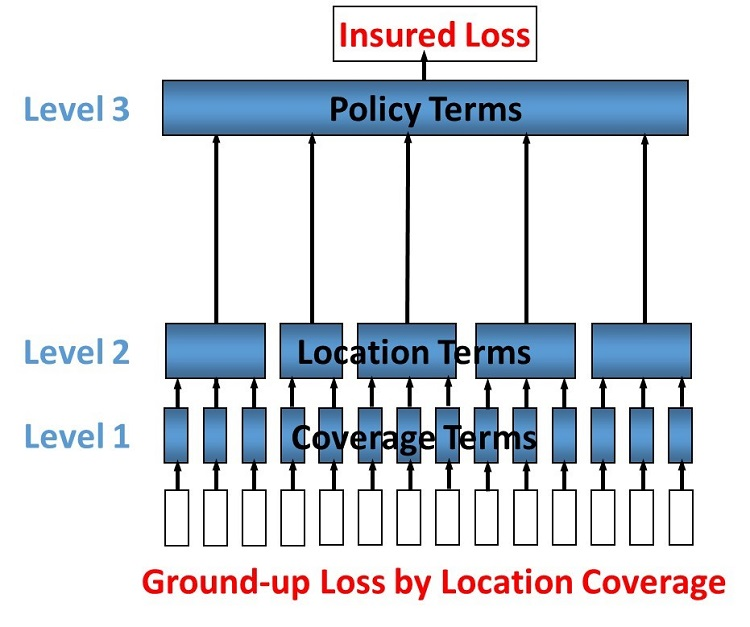
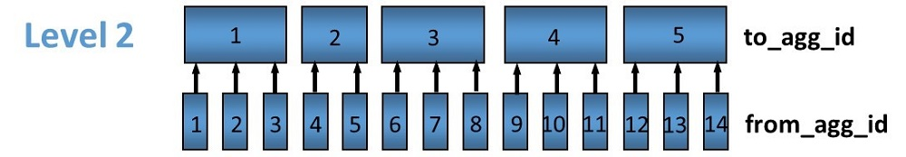
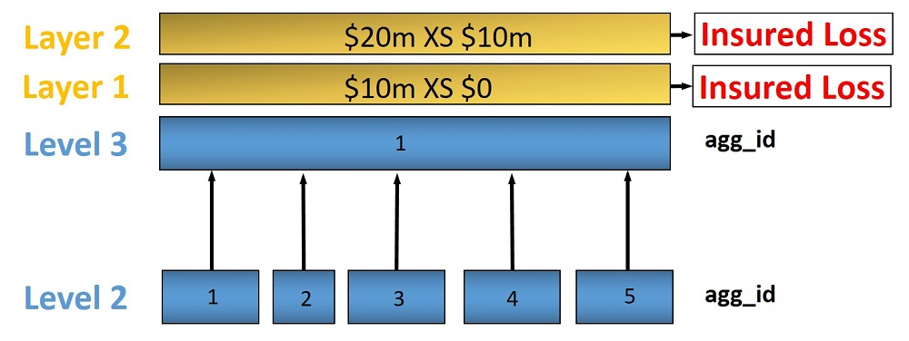
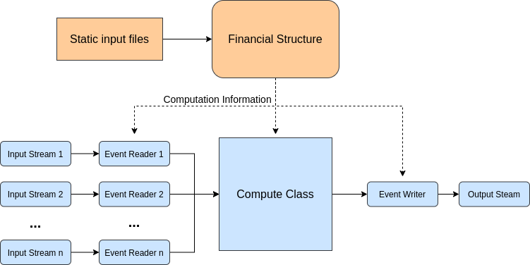

Financial Module
================

On this page
------------

* :ref:`intro_FM`
* :ref:`support_FM`
    * :ref:`DI_support_FM`
    * :ref:`RI_support_FM`
* :ref:`overview_FM`
* :ref:`architecture_FM`

|

.. _intro_FM:

Introduction
************

----

The Oasis framework supports a wide range of financial calculations. Outputs can be generated for three perspectives:

* **Ground-up**: the underlying cost of loss.

* **Insured loss**: the loss ceded to the direct insurance contracts.

* **Net loss**: the insured loss net of reinsurance  recoveries.

Exposure is uploaded in the :doc:`OED <../../sections/OED>` exposure format. See 
`here <https://github.com/simplitium/oed>`_ for full details. A full list of OED financial terms suppported by the **Financial Module** can be found in `OED_financial_terms_supported.xlsx <https://github.com/OasisLMF/OasisLMF/raw/main/docs/OED_financial_terms_supported.xlsx>`_.

|

.. _support_FM:

Supported OED terms
*******************

----

The **Financial Module** supports a range of OED terms for both **Direct Insurance** and **Reinsurance**. These are 
listed accordingly below.

|

|

.. _DI_support_FM:

Direct insurance support
########################

----

Listed below are the **Direct Insurance** terms that are supported by the **Financial Module**: 

* Any combination of coverage, combined, site, sublimit or “special conditions” and policy terms
* Deductibles, limits & shares
* Min and max deductibles
* Excess layers
* Deductible and limits as a percentage of loss or TIV
* Step policies

|

A table containing all OED input fields and notes on the implementation of the financial terms can be found 
`here <https://github.com/OasisLMF/OasisLMF/blob/main/docs/OED_financial_terms_supported.xlsx>`_.

|

Direct insurance terms
""""""""""""""""""""""

The content below describes at a high level the order in which direct insurance terms are applied.

All supported direct insurance terms are associated with a fixed 'FM level'. The level specifies how losses should be 
grouped together for processing. If no terms are present for a level, it is skipped in the calculation. However 
Levels 1 and 6 are always calculated, with passthrough rules where there are no terms. Terms are applied in ascending 
FM Level order, and within each level in the order described in the table below. The order within level is determined 
by a specific calcrule that is invoked by the calculation. The calculated loss is passed from one level to the next, 
and the output from the final level is the gross loss.

|

.. csv-table::
    :header: "FM Level description", "FM Level number", "Order within level", "Fields",	"Coverages"

    "Coverage",	"1", "Deductibles then limits",	"LocDed{Cov}, LocMinDed{Cov}, LocMaxDed{Cov},LocLimit{Cov}", "1,2,3,4"
    "Combined",	"2", "Deductibles then limits",	"LocDed{Cov}, LocMinDed{Cov}, LocMaxDed{Cov},LocLimit{Cov}", "5"
    "Site",	"3", "Deductibles then limits",	"LocDed{Cov}, LocMinDed{Cov}, LocMaxDed{Cov},LocLimit{Cov}", "6"
    "Cond",	"4", "Deductibles then limits",	"CondDed{Cov}, CondMinDed{Cov}, CondMaxDed{Cov},CondLimit{Cov}", "6"
    "Pol", "5",	"Deductibles then limits", "PolDed{Cov}, PolMinDed{Cov}, PolMaxDed{Cov},PolLimit{Cov}",	"1,2,3,4"
    "Pol", "6",	"Deductibles then limits", "PolDed{Cov}, PolMinDed{Cov}, PolMaxDed{Cov},PolLimit{Cov}",	"5"
    "Pol", "7",	"Deductibles then limits", "PolDed{Cov}, PolMinDed{Cov}, PolMaxDed{Cov},PolLimit{Cov}",	"6"
    "Layer", "8", "Attachment, then limit, then participation",	"LayerAttachment, LayerLimit, LayerParticipation", "n/a"

|

|

.. _RI_support_FM:

Reinsurance support
###################

----

Listed below are the **Reinsurance** terms that are supported by the **Financial Module**: 

* Facultative
* Quota share
* Surplus share
* Per risk excess of loss
* Occurrence catastrophe excess of loss
* Risk definition - Location, Policy or Account
* Multiple inuring priorities

|

Reinsurance terms
"""""""""""""""""

The content below describes at a high level the order in which reinsurance terms are applied.

The following types of reinsurance are supported and use the fields in reinsurance info and reinsurance scope files 
indicated in the matrix.

|

.. csv-table::
    :header: "ReinsType", "Description", "CededPercent", "RiskAttachment", "RiskLimit",	"OccAttachment", "OccLimit", "PlacedPercent"
    
    "FAC", "Facultative", "x", "x", "x", " ", " ", "x"
    "QS", "Quota Share", "x", " ", "x", "x", "x", "x"
    "SS", "Surplus Share", "x*",  "x", "x", " ", "x", "x"
    "PR", "Per Risk Excess of Loss", "x",  "x", "x", " ", "x", "x"
    "CXL", "Catastrophe Excess of Loss", "x",  " ", " ", "x", "x", "x"

\*Only for Surplus Share is CededPercent specified per risk and taken from the reinsurance scope file. All other 
reinsurance types use the CededPercent in the reinsurance info file.

|

Each Reinsurance contract (identified by ReinsNumber) is allocated to a processing cycle depending on the 
InuringPriority and RiskLevel. The number of cycles will vary depending on the data in the ri_info and ri_scope file. 
The contracts are allocated to a processing cycle based on InuringPriority and RiskLevel and processed in cycle order. 
The net loss is output from each processing cycle and feeds into the next processing cycle. 

|

.. csv-table::
    :header: "Cycle", "Inuring Priority", "Risk Level"
    
    "1", "1", "LOC"
    "2", "1", "POL"
    "3", "1", "ACC"
    "4", "1", "(blank)"
    "5", "2", "LOC"
    "6", "2", "POL"
    "7", "2", "ACC"
    "8", "2", "(blank)"
    "9", "3", ".."
|

Within each cycle there are three fixed levels of calculation. Each level involves summing losses and then applying a 
financial terms calculation.

* **Location Policy Level**: The first level sums losses by location and by policy. The calculation filters losses 
  that are within the scope of each reinsurance layer and passes them through to the next level. All other losses are 
  set to zero because they are outside the scope of the contract.
* **Risk Level**: The second level sums loss to the Risk Level (either location, or policy, or account) and applies 
  the CededPercent and then any risk terms to the losses.
* **Contract Level**: The third level groups losses to the contract level (which means summing losses across all 
  risks in scope of the reinsurance layer) and applies the occurrence terms and finally the PlacedPercent which 
  results in the Reinsurance contract loss

The final step is to difference the input and the output, and pass through the net loss to the next processing cycle.

|

.. csv-table::
    :header: "FM Level description", "FM Level number", "Order within level"

    "Location policy level", "1", " "
    "Risk level", "2", "CededPercent, RiskAttachment, RiskLimit"
    "Contract level", "3", "OccAttachment, OccLimit, PlacedPercent"
|

|

.. _overview_FM:

Financial module overview
************************

----

The Oasis Financial Module is a data-driven process design for calculating the losses on (re)insurance contracts. It 
has an abstract design in order to cater for the many variations in contract structures and terms. The way Oasis 
works is to be fed data in order to execute calculations, so for the insurance calculations it needs to know the 
structure, parameters and calculation rules to be used. This data must be provided in the files used by the Oasis 
Financial Module:

* **fm_programme**: defines how coverages are grouped into accounts and programmes
* **fm_profile**: defines the layers and terms
* **fm_policytc**: defines the relationship of the contract layers
* **fm_xref**: specifies the summary level of the output losses

This section explains the design of the Financial Module which has been implemented in the **fmcalc** component.

* Runtime parameters and usage instructions for fmcalc are covered `here <https://github.com/OasisLMF/ktools/blob/0e45e67c162ca3e4e4a780700a32836a49f23944/docs/md/CoreComponents.md>`_.
* The formats of the input files are covered `here <https://github.com/OasisLMF/ktools/blob/0e45e67c162ca3e4e4a780700a32836a49f23944/docs/md/DataConversionComponents.md>`_.

In addition, there is a separate github repository `ktest <https://github.com/OasisLMF/ktest>`_ which is an extended 
test suite for ktools and contains a library of financial module worked examples provided by Oasis Members with a 
full set of input and output files.

.. note::
    Note that other reference tables are referred to below that do not appear explicitly in the kernel as they are 
    not directly required for calculation. It is expected that a front end system will hold all of the exposure and 
    policy data and generate the above four input files required for the kernel calculation.
|

Scope
#####

The Financial Module outputs sample by sample losses by (re)insurance contract, or by item, which represents the 
individual coverage subject to economic loss from a particular peril. In the latter case, it is necessary to 
‘back-allocate’ losses when they are calculated at a higher policy level. The Financial Module can output retained 
loss or ultimate net loss (UNL) perspectives as an option, and at any stage in the calculation.

The output contains anonymous keys representing the (re)insurance policy (``agg_id`` and ``layer_id``) at the chosen 
output level (``output_id``) and a loss value. Losses by sample number (``idx``) and event (``event_id``) are produced. 
To make sense of the output, this output must be cross-referenced with Oasis dictionaries which contain the meaningful 
business information.

The Financial Module does not support multi-currency calculations.

|

Profiles
########

Profiles are used throughout the Oasis framework and are meta-data definitions with their associated data types and 
rules. Profiles are used in the Financial Module to perform the elements of financial calculations used to calculate 
losses to (re)insurance policies. For anything other than the most simple policy which has a blanket deductible and 
limit, say, a profile do not represent a policy structure on its own, but rather is to be used as a building block 
which can be combined with other building blocks to model a particular financial contract. In this way it is possible 
to model an unlimited range of structures with a limited number of profiles.

The FM Profiles form an extensible library of calculations defined within the fmcalc code that can be invoked by 
specifying a particular ``calcrule_id`` and providing the required data values such as deductible and limit, as 
described below.

|

**Supported Profiles**

See `here <https://github.com/OasisLMF/ktools/blob/0e45e67c162ca3e4e4a780700a32836a49f23944/docs/md/fmprofiles.md>`_ 
for more details on FM profiles.

|

Design
######

The Oasis Financial Module is a data-driven process design for calculating the losses on insurance policies. It is an 
abstract design in order to cater for the many variations and has four basic concepts:

1. A **programme** which defines which **items** are grouped together at which levels for the purpose of providing 
loss amounts to policy terms and conditions. The programme has a user-definable profile and dictionary called prog 
which holds optional reference details such as a description and account identifier. The prog table is not required 
for the calculation and therefore does not appear in the kernel input files.

2. A policytc **profile** which provides the parameters of the policy’s terms and conditions such as limit and 
deductible and calculation rules.

3. A **policytc** cross-reference file which associates a policy terms and conditions profile to each programme level 
aggregation.

4. A **xref** file which specifies how the output losses are summarized.

The profile not only provides the fields to be used in calculating losses (such as limit and deductible) but also 
which mathematical calculation (``calcrule_id``) to apply.

|

Data requirements
#################

The Financial Module brings together three elements in order to undertake a calculation:

* Structural information, notably which items are covered by a set of policies.
* Loss values of items.
* Policy profiles and profile values.

There are many ways an insurance loss can be calculated with many different terms and conditions. For instance, there 
may be deductibles applied to each element of coverage (e.g. a buildings damage deductible), some site-specific 
deductibles or limits, and some overall policy deductibles and limits and share. To undertake the calculation in the c
orrect order and using the correct items (and their values) the structure and sequence of calculations must be 
defined. This is done in the **programme** file which defines a heirarchy of groups across a number of **levels**. 
Levels drive the sequence of calculation. A financial calculation is performed at successive levels, depending on the 
structure of policy terms and conditions. For example there might be 3 levels representing coverage, site and policy 
terms and conditions.

|

**Figure 1. Example 3-level programme hierarchy**

|

|

Groups are defined within levels and they represent aggregations of losses on which to perform the financial 
calculations. The grouping fields are called from_agg_id and to_agg_id which represent a grouping of losses at the 
previous level and the present level of the hierarchy, respectively.

Each level calculation applies to the to_agg_id groupings in the heirarchy. There is no calculation applied to the 
from_agg_id groupings at level 1 - these ids directly correspond to the ids in the loss input.

|

**Figure 2. Example level 2 grouping**

|

|

Loss values
"""""""""""

The initial input is the ground-up loss (GUL) table, generally coming from the main Oasis calculation of ground-up 
losses. Here is an example, for a two events and 1 sample (idx=1):

|
.. csv-table::
    :header: "event_id", "item_id", "sidx", "loss"

    "1", "1", "1", "100,000"
    "1", "2", "1", "10,000"
    "1", "3", "1", "25,000"
    "1", "4", "1", "400"
    "2", "1", "1", "90,000"
    "2", "2", "1", "15,000"
    "2", "3", "1", "3,000"
    "2", "4", "1", "500"
|

The values represent a single ground-up loss sample for items belonging to an account. We use “programme” rather than 
"account" as it is more general characteristic of a client’s exposure protection needs and allows a client to have 
multiple programmes active for a given period. The linkage between account and programme can be provided by a user 
defined **prog** dictionary, for example:

|
.. csv-table::
    :header: "prog_id", "account_id", "prog_name"
    
    "1", "1", "ABC Insurance Co. 2016 renewal"
|

Items 1-4 represent Structure, Other Structure, Contents and Time Element coverage ground up losses for a single 
property, respectively, and this example is a simple residential policy with combined property coverage terms. For 
this policy type, the Structure, Other Structure and Contents losses are aggregated, and a deductible and limit is 
applied to the total. A separate set of terms, again a simple deductible and limit, is applied to the “Time Element” 
coverage which, for residential policies, generally means costs for temporary accommodation. The total insured loss 
is the sum of the output from the combined property terms and the time element terms.

|

Programme
"""""""""

The actual items falling into the programme are specified in the programme table together with the aggregation 
groupings that go into a given level calculation:

|
.. csv-table::
    :header: "from_agg_id", "level_id", "to_agg_id"
    
    "1", "1", "1"
    "2", "1", "1"
    "3", "1", "1"
    "4", "1", "2"
    "1", "2", "1"
    "2", "2", "1"
|

Note that ``from_agg_id`` for ``level_id`` =1 is equal to the ``item_id`` in the input loss table (but in theory 
``from_agg_id`` could represent a higher level of grouping, if required).

In level 1, items 1, 2 and 3 all have ``to_agg_id`` =1 so losses will be summed together before applying the combined 
deductible and limit, but item 4 (time element) will be treated separately (not aggregated) as it has ``to_agg_id`` 
= 2. For level 2 we have all 4 items losses (now represented by two groups ``from_agg_id`` =1 and 2 from the previous 
level) aggregated together as they have the same ``to_agg_id`` = 1.

|

Profile
"""""""

Next we have the profile description table, which list the profiles representing general policy types. Our example is 
represented by two general profiles which specify the input fields and mathematical operations to perform. In this 
example, the profile for the combined coverages and time is the same (albeit with different values) and requires a 
limit, a deductible, and an associated calculation rule, whereas the profile for the policy requires a limit, 
attachment, and share, and an associated calculation rule.

|
.. csv-table::
    :header: "Profile description", "calcrule_id"

    "deductible and limit", "1"
    "deductible and/or attachment, limit and share", "2"
|

There is a “profile value” table for each profile containing the applicable policy terms, each identified by a 
``policytc_id``. The table below shows the list of policy terms for ``calcrule_id`` 1:

|
.. csv-table::
    :header: "policytc_id", "deductible1", "limit1"

    "1", "1,000", "1,000,000"
    "2", "2,000", "18,000"
|

And next, for ``calcrule_id`` 2, the values for the overall policy attachment, limit and share:

|
.. csv-table::
    :header: "policytc_id", "deductible1", "attachment1", "limit1", "share1"

    "3", "0", "1,000", "1,000,000", "0.1"
|

In practice, all profile values are stored in a single flattened format which contains all supported profile fields 
(see fm profile `here <https://github.com/OasisLMF/ktools/blob/0e45e67c162ca3e4e4a780700a32836a49f23944/docs/md/DataConversionComponents.md>`_), 
but conceptually they belong in separate profile value tables.

The flattened file is:

``fm_profile``

|
.. csv-table::
    :header: "policytc_id", "calcrule_id", "deductible1", "deductible2", "deductible3", "attachment1", "limit1", "share1", "share2", "share3"

    "1", "1", "1,000", "0", "0", "0", "1,000,000", "0", "0", "0"
    "1", "1", "2,000", "0", "0", "0", "18,000", "0", "0", "0"
    "1", "2", "0", "0", "0", "1,000", "1,000,000", "0.1", "0", "0"
|

For any given profile we have one standard rule ``calcrule_id``, being the mathematical function used to calculate 
the losses from the given profile’s fields. More information about the functions can be found 
`here <https://github.com/OasisLMF/ktools/blob/0e45e67c162ca3e4e4a780700a32836a49f23944/docs/md/fmprofiles.md>`_.

|

Policytc
""""""""

The **policytc** table specifies the (re)insurance contracts (this is a combination of ``agg_id`` and ``layer_id``) 
and the separate terms and conditions which will be applied to each ``layer_id``/``agg_id`` for a given level. In our 
example, we have a limit and deductible with the same value applicable to the combination of the first three items, a 
limit and deductible for the fourth item (time) in level 1, and then a limit, attachment, and share applicable at 
level 2 covering all items. We’d represent this in terms of the distinct ``agg_ids`` as follows:

|
.. csv-table::
    :header: "layer_id", "level_id", "agg_id", "policytc_id"

    "1", "1", "1", "1"
    "1", "1", "2", "2"
    "1", "2", "1", "3"
|

In words, the data in the table mean:

At Level 1:

* Apply ``policytc_id`` (terms and conditions) 1 to (the sum of losses represented by) ``agg_id`` 1

* Apply ``policytc_id`` 2 to agg_id 2

Then at level 2:

* Apply ``policytc_id`` 3 to ``agg_id`` 1

Levels are processed in ascending order and the calculated losses from a previous level are summed according to the 
groupings defined in the programme table which become the input losses to the next level.

|

**Layers**

Layers can be used to model multiple sets of terms and conditions applied to the same losses, such as excess policies. 
For the lower level calculations and in the general case where there is a single contract, ``layer_id`` should be set 
to 1. For a given ``level_id`` and ``agg_id``, multiple layers can be defined by setting ``layer_id`` =1,2,3 etc, and 
assigning a different calculation ``policytc_id`` to each.

|

**Figure 3. Example of multiple layers**

|

|

For this example at level 3, the policytc data might look as follows:

|
.. csv-table::
    :header: "layer_id", "level_id", "agg_id", "policytc_id"

    "1", "3", "1", "22"
    "2", "3", "1", "23"
|

Output and back-allocation
""""""""""""""""""""""""""

Losses are output by event, ``output_id`` and sample. The table looks like this:

|
.. csv-table::
    :header: "event_id", "output_id", "sidx", "loss"

    "1", "1", "1", "455.24"
    "2", "1", "1", "345.6"
|

The output_id is specified by the user in the xref table, and is a unique combination of ``agg_id`` and ``layer_id``. 
For instance:

|
.. csv-table::
    :header: "output_id", "agg_id", "layer_id"

    "1", "1", "1"
    "2", "1", "2"
|

The ``output_id`` must be specified consistently with the back-allocation rule. Losses can either output at the 
contract level or back-allocated to the lowest level, which is ``item_id``, using one of three command line options. 
There are three meaningful values here – don’t allocate (0) used typically for all levels where a breakdown of losses 
is not required in output, allocate back to items (1) in proportion to the input (ground up) losses, or allocate back 
to items (2) in proportion to the losses from the prior level calculation.

|
.. code-block:: sh

    $ fmcalc -a0 # Losses are output at the contract level and not back-allocated
    $ fmcalc -a1 # Losses are back-allocated to items on the basis of the input losses (e.g. ground up loss)
    $ fmcalc -a2 # Losses are back-allocated to items on the basis of the prior level losses
|

The rules for specifying the ``output_ids`` in the xref table are as follows:

* **Rule 1**: there is an ``output_id`` for every ``agg_id`` and ``layer_id`` of the final level in the **policytc** table
* **Rule 2**: there is an ``output_id`` for every ``from_agg_id`` of the first level in the **programme** table, and for 
  every ``layer_id`` in the final level of the **policytc** table

To make sense of this, if there is more than one output at the contract level, then each one must be back-allocated 
to all of the items, with each individual loss represented by a unique ``output_id``.

To avoid unnecessary computation, it is recommended not to back-allocate unless losses are required to be reported at 
a more detailed level than the contract level (site or zip code, for example). In this case, losses are re-aggregated 
up from item level (represented by ``output_id`` in fmcalc output) in ``summarycalc``, using the ``fmsummaryxref`` 
table.

|

Reinsurance
###########

The first run of fmcalc is designed to calculate the primary or direct insurance losses from the ground up losses of 
an exposure portfolio. fmcalc has been designed to be recursive, so that the 'gross' losses from the first run can be 
streamed back in to second and subsequent runs of fmcalc, each time with a different set of input files representing 
reinsurance contracts, and can output either the reinsurance gross loss, or net loss. There are two modes of output:

* **gross** meaning the loss to the policies or reinsurance contracts, and
* **net** being the difference between the input loss and the policy/contract losses

**net** loss is output when the command line parameter -n is used, otherwise output loss is gross by default.

|

Supported reinsurance types
"""""""""""""""""""""""""""

The types of reinsurance supported by the Financial Module are:

* **Facultative** proportional or excess
* **Quota share** with event limit
* **Surplus share** with event limit
* **Per risk** with event limit
* **Catastrophe excess of loss** occurrence only

|

Required files
""""""""""""""

Second and subsequent runs of fmcalc require the same four fm files ``fm_programme``, ``fm_policytc``, ``fm_profile``, 
and ``fm_xref``.

This time, the hierarchy specified in ``fm_programme`` must be consistent with the range of ``output_ids`` from the 
incoming stream of losses, as specified in the ``fm_xref`` file from the previous iteration. Specifically, this means 
the range of values in ``from_agg_id`` at level 1 must match the range of values in ``output_id``.

For example:

**fm_xref (iteration 1)**

|
.. csv-table::
    :header: "output_id", "agg_id", "layer_id"

    "1", "1", "1"
    "2", "1", "2"
|

**fm_programme (iteration 2)**

|
.. csv-table::
    :header: "from_agg_id", "level_id", "to_agg_id"

    "1", "1", "1"
    "2", "1", "2"
    "1", "2", "1"
    "2", "2", "1"
|

The abstraction of ``from_agg_id`` at level 1 from ``item_id`` means that losses needn't be back-allocated to 
``item_id`` after every iteration of fmcalc. In fact, performance will be improved when back-allocation is minimised.

|

Example - Quota share reinsurance
"""""""""""""""""""""""""""""""""

Using the two layer example from above, here's an example of the fm files for a simple quota share treaty with 50% 
ceded and 90% placed covering both policy layers.

The command to run the direct insurance followed by reinsurance might look like this:

|

.. code-block:: sh

    $ fmcalc -p direct < guls.bin | fmcalc -p ri1 -n > ri1_net.bin
|

In this command, ground up losses are being streamed into fmcalc to calculate the insurance losses, which are streamed 
into fmcalc again to calculate the reinsurance net loss. The direct insurance fm files would be located in the folder 
'``direct``' and the reinsurance fm files in the folder '``ri1``'. The -n flag in the second call of fmcalc results in 
net losses being output to the file '``ri1_net.bin``'. These are the losses to the insurer net of recoveries from the 
quota share treaty.

The fm_xref file from the direct insurance (first) iteration is:

**fm_xref**

|
.. csv-table::
    :header: "output_id", "agg_id", "layer_id"

    "1", "1", "1"
    "2", "1", "2"
|

The fm files for the reinsurance (second) iteration would be as follows;

**fm_programme**

|
.. csv-table::
    :header: "from_agg_id", "level_id", "to_agg_id"

    "1", "1", "1"
    "2", "1", "1"
|

**fm_policytc**

|
.. csv-table::
    :header: "layer_id", "level_id", "agg_id", "policytc_id"

    "1", "1", "1", "1"
|

**fm_profile**

|
.. csv-table::
    :header: "policytc_id", "calcrule_id", "deductible1", "deductible2", "deductible3", "attachment1", "limit1", "share1", "share2", "share3"

    "1", "25", "0", "0", "0", "0", "0", "0.5", "0.9", "1"
|

**fm_xref**

|
.. csv-table::
    :header: "output_id", "agg_id", "layer_id"

    "1", "1", "1"
|

Inuring priority
""""""""""""""""

The Financial Module can support unlimited inuring priority levels for reinsurance. Each set of contracts with equal 
inuring priority would be calculated in one iteration. The net losses from the first inuring priority are streamed 
into the second inuring priority calculation, and so on.

Where there are multiple contracts with equal inuring priority, these are implemented as layers with a single 
iteration.

The net calculation for iterations with multiple layers is:

    net loss = max(0, input loss - layer1 loss - layer2 loss - ... - layer n loss)

|

|

.. _architecture_FM:

Financial module architecture design
************************************

----

Manager is the high level entry point to run an Financial Module computation. It orchestrates the different modules together in order to process the incoming events. Each event is read one at a time from available input streams. We then compute the result and write it to the output stream.

|

|

The basic idea of the architecture of the Financial Module is that, in each event, we only compute nodes that need it. When an event is read, the ``node_id`` corresponding to each item is added to a "computes" queue. During the bottom up part, where losses are aggregated to higher levels, the loss of a nodeis computed and then its parent node is added in the queue. The node is also added to the list of active children for the parent node. This way the parent node only aggregate the loss of active children.

During back-allocation, the process is repeated, but this time its the parent node that adds its children to the 'compute' queue.

Overall the fm computation is done in two steps:

**1.** Creation of the shared static financial structure files. ex: ``fmpy --create-financial-structure-files -a 2``

**2.** Event computation ex: ``fmpy -i stream_in -o stream_out -a 2``

|

Financial Structure
###################

The purpose of this module is to parse the static input financial structure and consolidate the information into simple objects ready to be use by the compute function. The idea is to factorise all the computation and logic that can be done at this step and prepare everything possible to have a generic way to handle the computation for each item.

The object created during the financial structure step are all numpy ndarrays. This presents many advantages.

* numpy provides an easy way to have them stored.
* They can be loaded as a shared memory objects for all the compute processes, which greatly reduces memory usage.
* They are very fast and compact.

In particular, those are preferred to the numba dictionaries and lists, even when it would be simpler to use because they are much faster at the moment (early 2021). This means that all the references from an objet to other objects need to be done via a pointer like logic. For example, the node ids of the parents of a node are referenced in ``node_array`` with a length (``parent_len``) and the index of the first parent id in ``node_parent_array``.

|

Inputs
""""""

The necessary static inputs for the **Financial Module** are expected to be in the same folder with the extention 
'``.bin``' for binaries and '``.cvs``' for text files:

* ``fm_programme``: the basic hierarchy of nodes organised by level and aggregation id
* ``fm_policytc``: the policy id to apply to each node and layer described in the programme
* ``fm_profile`` or ``fm_profile_step``: the profile (detailed values) of each policy id
* ``fm_xref``: the mapping between result items and the output ID

Additionally if %tiv policies are present, those two extra files will be needed:

* **items**: link between ``item_id`` and ``coverage_id``
* **coverage**: link between ``coverage_id`` and ``TIV``

In productions, inputs are read directly using ``numpy.fromfile``, with named dtype specific to each file name. This allows one to access each value in a row like a dictionary and also provide a compatible interface for the two profile options (step or non step policy). We make a realistic assumption that the input and output data will fit in memory.

|

Outputs
"""""""

The transform static information needed to build and execute the computation for each event:

* **compute_info**:
  Contains the general information on the financial structure such as the allocation rule, the number of levels and whether there is stepped policy. It also contains the length of all the other ndarrays.
* **nodes_array**:
  All the static information about a node, such as ``level_id``, ``agg_id``, number of layers, and number of policies. Referenced to its parents, children, profiles and different loss array.
* **node_parents_array**:
  Contains the index of parent node in ``node_array``.
* **node_profiles_array**:
  Contains the index of the node profile in ``fm_profile``.
* **output_array**:
  Contains the ``item_id`` of the output losses of each layer of a node (generated from xref).
* **fm_profile**: 
  Contains the final version of all the policies in the original ``fm_profile`` (for example, we compute the real tiv in order replace all %tiv policy values).

|

Computation
###########

The computation of the loss itself can only be done after the financial structure creation step.

The manager module will then load this shared structure and then create all the dynamic arrays:

* **losses** and **loss_indexes**: arrays to reference and store all losses.
* **extras** and **extra_indexes**: arrays to reference and store the extra values such as ``deductible``, ``under_limit``, and ``over_limit``.
* **children**: array of active children for each parant node.
* **computes**: contains the index of all the nodes to compute.

One thing to note with this architecture is that a node doesn't really 'own' its different losses. It only has a reference to it via ``loss_indexes``. This is very important as it allows us to share the array between nodes if they happen to be the same. As we only copy the reference, this drastically reduces the amount of data copied in several cases.

* When a parent node has only one active child, then the aggregation of losses is not needed. The parent node ``sum_loss`` will simply point to its children ``il_loss``.
* When a node has a pass through profile (id 100), it's ``il_loss`` will point to its ``sum_loss``.
* During the back allocation, if a parent has only one child, the ``ba_loss`` of the child will simply point to the ``ba_loss`` of the parent.

Once those structures are created, the manager will orchestrate the processes event by event:

**1.** An event is read - all the items of the event are placed in the compute queue.

**2.** An incremental pointer to computes ``compute_i`` tracks which nodes need to be computed. The computation  starts with the bottom up step. For each node, we aggregate the sub loss, apply the profile, and put the parent node in the queue. If the value it points to is 0, we are at the end of the level and can go to the next one. Then, depending on rule, we continue the same logic for the back allocation, only this time it goes from parent to children.

**3.** The stream writer reads the last level of 'computes' and writes each active item and its loss to the output stream.

|

Policies
""""""""

The policy module contains all the functions associated to the supported policy. They all take the same numpy array as input and acts directly on them (inplace).

Signature: ``calcrule_i(policy, loss_out, loss_in, deductible, over_limit, under_limit)`` loss is present in two arrays because, in some cases, we want to keep the sum value before the calc rule is applied (if this is not the case, the arrays are the same object).

|

Stream
""""""

The stream module is responsible for the parsing and writing of the gul and fm streams. The stream reader is able to read from multiple streams using the selector module of python.