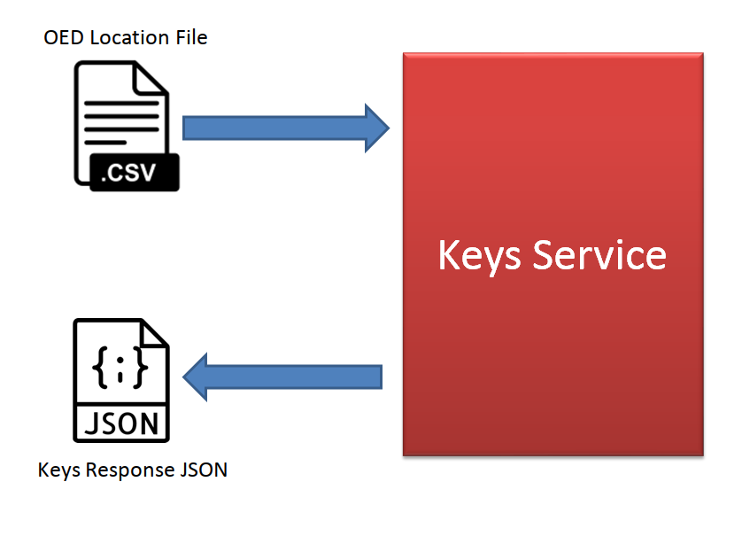
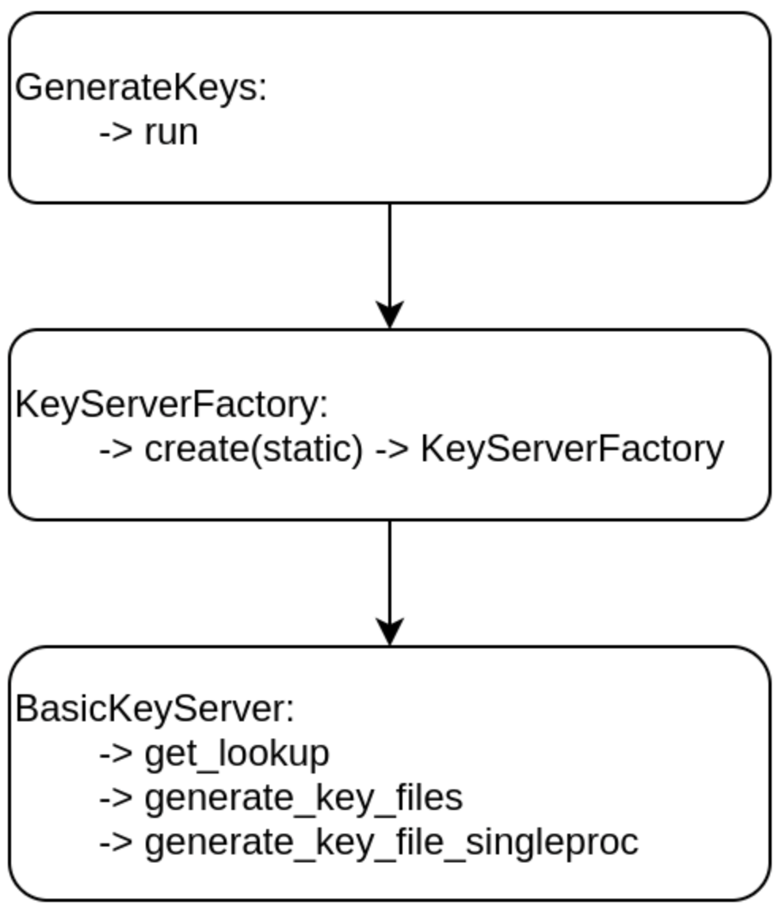

Keys Service
============

On this page
------------

* :ref:`intro_keys`
* :ref:`interface_keys`
* :ref:`config_keys`
* :ref:`built_in_functions_keys`

|

.. _intro_keys:

Introduction
------------

The keys service in the Oasis Loss Modelling Framework is the process which is used to map exposure data (in OED format) 
into the into the model specific keys required to execute analyses against that model in the core calculation kernel. This 
document specifies the requirements form the keys service for a typical implementation of an Oasis LMF compliant model. It 
should be noted that this document does not cover the example of a complex model implementation, where the requirements are 
much more loose, but focusses on the standard implementation where all of the regular ktools components are utilised in the 
calculation kernel.

|

High Level Overview
###################

At a high level, a keys service implementation should accept, as input, an OED Location file and return a JSON stream 
including the oasis keys per location/coverage type/sub-peril, along with reasons for non-mapped 
location/coverage-type/sub-peril combinations where they are outside of the remit of the model

|

Return JSON specification
#########################

The return JSON should subscribe to the following definition:

.. code-block:: JSON

    {
    "loc_id": <integer location id from input OED file>,
    "peril_id": <sub-peril id for model (see below)>,
    "coverage_type": <coverage type id (see below)>,
    "area_peril_id": <integer id of the area peril in the footprint file>
    "vulnerability_id": <integer id of the vulnerability function in the vulnerability file>,
    "status": <one of the accepted statuses (see below)>,
    "message": <message to accompany status>
    }

|

Perils Covered
##############

It is the responsibility of the keys service to identify the exposures in the input location file are to be modelled. 
Included in this definition is the identification of risks by perils covered. The keys service implementation should use 
the “LocPerilsCovered” field in the input location OED file to identify and filter out those locations which are covered by 
the model and those which are not. If a location in the input file has only location perils covered which are not 
considered by the model, then this location should receive a failure status (see below), be rejected by the keys service and 
not be assigned an areaperil id value.

|

Coverage Type
##############

The coverage type field returned in the JSON stream should comply to the Oasislmf standard supported coverage types:

**1:** Buildings

**2:** Other

**3:** Contents

**4:** Business Interruption (BI)

|

Status
######

The status returned by the keys service should comply with the accepted status values included in the oasislmf package. 
These accepted statuses are:

**success:** the location/coverage type/sub-peril combination has an area peril and vulnerability id mapped

**fail:** the location/coverage type/sub-peril combination has neither area peril or vulnerability id mapped

**fail_ap:** the location/coverage type/sub-peril combination has no area peril but a successful vulnerability id mapped

**fail_v:** the location/coverage type/sub-peril combination has a successful area peril but no vulnerability id mapped

**notatrisk:** the location/coverage type/sub-peril combination is within the realm of the model but deemed to be not at 
risk. This can be used to show that the risk is considered (and so the TIV will be counted in any exposure metrics) but will 
never generate a loss from the events in the footprint.

.. note::
   There are two additional defined statuses but these should not be included in the keys service return:

**nomatch:** this is a legacy status which is no longer used

**noreturn:** this is a status used by oasislmf to highlight exposure records for which no keys service returns were made, 
wither successful or not.

|

Messages
########

A free text message can be returned with the keys service return JSON. This message should be used to describe the reason 
for no oasis key being assigned (e.g. location is outside of model domain) and should be concise while clear enough for a 
user to understand the issue. Messages only need to be returned with one of the fail statuses.

|

Best Practice
#############

The following list details the expectations from the keys service implementation:

1. **OED location file fields:** The keys service implementation should accept valid OED location file fields

2. **Case Sensitivity:** The OED field names should not be case sensitive, so the keys service implementation should not be 
   sensitive to a particular format

3. **Peril mapping:** It is the responsibility of the keys service to interpret the “LocPerilsCovered” field in the OED 
   input file and assess whether the risk is in scope for the model or not.

4. **Complete reporting:** The keys service should return records for all risks submitted in the input location file. If a 
   risk is deemed to be out of scope, then the keys service should report that back to oasislmf and not simply ignore the 
   record.

5. **Coverage Types:** The keys service implementation should return records for all coverage types which are included in 
   the model. If the model does not include damage for a particular coverage type at all (e.g. BI) then there is no need to 
   return any values for this coverage type.

6. **Not at Risk:** If a risk is deemed to be within scope for the model but not at risk for any of the events in the 
   footprint, then the record should be returned with the “notatrisk” status and not with a dummy areaperil value, say. Not at 
   risk items will be included in exposure counts but will not be entered into the calculation kernel.

|

.. _interface_keys:

Interface for Keys lookup
-------------------------

The Keys look up process interface now has a new generic interface in order to reduce the amount of code needed to define 
and run a keys look up process.

|

Setup
#####

|

Basic execution
***************

This section goes through step by step on how to run a basic model.

Before we use the new interface we should explore how we run the lookup process in general. This can be done with the 
command below:

.. code-block:: python

   oasislmf model run --config ./us_oasislmf_mdk.json

What we have done is merely run the model using the `oasislmf <https://pypi.org/project/oasislmf/>`_ pip module. Here we 
have to define the config file. If we look at the config file for this example, we get the following contents:

.. code-block:: JSON

   {
   "analysis_settings_json": "analysis_settings.json",
   "lookup_data_dir": "keys_data/US_FLOOD",
   "model_data_dir": "model_data/US_FLOOD",
   "model_version_csv": "keys_data/US_FLOOD/ModelVersion.csv",
   "oed_accounts_csv": "tests/exposures/test_acc.csv",
   "oed_location_csv": "tests/exposures/test_loc_10_eve1.csv",
   "write_chunksize": 200000,
   "lookup_config_json": "keys_data/US_FLOOD/new_key_server.json"
   }
|

What we have is the parameters for the execution of the model which we will explore in the general 
`config <https://github.com/OasisLMF/OasisLMF/wiki/general-config-file>`_ subsection.

It has to be noted that the ``lookup_config_json`` parameter is the one that we add if we want to use the new interface as 
this is the `lookup config <https://github.com/OasisLMF/OasisLMF/wiki/lookup-config-file>`_ that defines the steps for the 
lookup. The process behind running the keys lookup happens in the `oasislmf <https://pypi.org/project/oasislmf/>`_ package 
via the steps below:

|

|

Once the flow above has executed, the class that you have defined that inherits the ``Lookup`` class 
(`Lookup <https://github.com/OasisLMF/OasisLMF/blob/master/oasislmf/lookup/builtin.py>`_). This then runs the 
``process_locations`` function which will run the series of functions defined in the that are defined in the "strategy" 
section. When it comes to the ``process_locations`` function we do not overwrite it as the ``process_locations`` function 
in the base ``Lookup`` class is the function responsible for going through the ``stratergy`` list in the config. If we 
define a function in the strategy list, the ``process_locations`` function checks to see if our class has this. If it does 
not, then it runs a build function around this, assigns it to the return function as an attribute under the name of the 
step to our class and fires this. This may seem a little convoluted but do not worry, we will cover this more in depth now. 

First of all, we have to acknowledge that every step function has to return a pandas data frame that will get fed into the 
next step function. For our first example, we will build a function that will accept parameters and return a data frame. 
For this mini example, we will accept two integers and a string for a column name. We will then add the two integers and 
assign the result for ever row under the name of the column. We will call this function ``simple_add`` which can be defined 
with the code below:

.. code-block:: python

   def build_simple_add(one: int, two: int, name: str) -> "_internal_function":
      """
      This function builds the _internal_function making it ready to be called.
      
      :param one: (int) the first number to be added
      :param two: (int) the second number to be added
      :return: (_internal_function) the internal function ready to be called with a dataframe
      """
      def _internal_function(locations: DataFrame) -> DataFrame:
         """
         Adds the parameter one and two together and assigns it to a column under the name parameter.
         
         :param locations: (DataFrame) the dataframe to be processed from a previous step
         :return: (DataFrame) the input dataframe with the new column
         """
         locations[name] = one + two
         return locations
      return _internal_function
|

As long as this function is defined in our lookup class that we have defined which inherits the ``Lookup`` class, we can 
call it in our `lookup config <https://github.com/OasisLMF/OasisLMF/wiki/lookup-config-file>`_ file with the setup below:

.. code-block:: JSON

   {
      "model": {
         "supplier_id": "OasisLMF",
         "model_id": "PiWind",
         "model_version": "0.0.0.1"
      },
      "builtin_lookup_type": "new_lookup",
      "keys_data_path": "./",
      "step_definition": {
         "simple_add": {
               "columns": ["example"]
               "type": "simple_add",
               "parameters": {
                  "one": 1,
                  "two": 2,
                  "name": "example"
               }
         }
      }
      "strategy": ["simple_add"]
   }
|

This will run our ``simple_add`` function with the parameters defined in the JSON file above. Once the strategy sequence 
has finished the final result data frame will be passed forward for further processing. Even though we have built our 
``build_simple_add`` function we have to ensure that we do not have a ``simple_add`` attribute or function defined in our 
class otherwise this will try and run and the ``build_simple_add`` function will not be touched. It also has to be noted 
that we have signposted our ``["example"]`` column name in the ``"columns"`` field. This is to ensure that our ``example`` 
field is not wiped at the end of the process.

|

.. _built_in_functions_keys:

Built-in functions
##################

|

* **combine**

Build a function that will combine several strategy trying to achieve the same purpose by different mean into one.
For example, finding the correct area_peril_id for a location with one method using (latitude, longitude)
and one using postcode.

Each strategy will be applied sequentially on the location that steal have OASIS_UNKNOWN_ID in their id_columns after 
the precedent strategy.

|

* **split_loc_perils_covered**

Split the value of ``LocPerilsCovered`` into multiple lines, taking peril group into account.

Drop all lines that are not in the list ``model_perils_covered``.

|

* **prepare**

Prepare the dataframe by setting default, min and max values and type.

Support several simple DataFrame preparation:
   * default: create the column if missing and replace the nan value with the default value
   * max: truncate the values in a column to the specified max
   * min: truncate the values in a column to the specified min
   * type: convert the type of the column to the specified numpy dtype
.. note::
   We use the string representation of numpy dtype available at
   https://numpy.org/doc/stable/reference/arrays.dtypes.html#arrays-dtypes-constructing.

|

* **rtree**

Function Factory to associate location to ``area_peril`` based on the rtree method.

.. note::
   !!!
   Please note that this method is quite time consuming (especially if you use the nearest point option
   if your peril_area are square you should use area_peril function fixed_size_geo_grid).
   !!!

``file_path``: is the path to the file containing the ``area_peril_dictionary``
   * This file must be a geopandas Dataframe with a valid geometry
   * An example on how to create such dataframe is available in PiWind
   * If you are new to geo data (in python) and want to learn more, you may have a look at this excellent course:
   https://automating-gis-processes.github.io/site/index.html

``file_type``: can be any format readable by geopandas ('file', 'parquet', ...)
   * See: https://geopandas.readthedocs.io/en/latest/docs/reference/io.html (you may have to install additional library) 
     such as pyarrow for parquet

``id_columns``: column to transform to an 'id_column' (type int32 with nan replace by -1)

``nearest_neighbor_min_distance``: option to compute the nearest point if intersection method fails
   * We use: https://automating-gis-processes.github.io/site/notebooks/L3/nearest-neighbor-faster.html
   * But alternatives can be found here: https://gis.stackexchange.com/questions/222315?geopandas-find-nearest-point-in-other-dataframe

|

* **fixed_size_geo_grid**

Associate an id to each square of a grid define by the limit of lat and lon

|

* **merge**

This method will merge the locations Dataframe with the Dataframe present in ``file_path``

All non match column present in ``id_columns`` will be set to -1

Τhis is an efficient way to map a combination of column that have a finite scope to an idea

|

* **simple_pivot**

Αllow to pivot columns of the locations dataframe into multiple rows.

Εach pivot in the pivot list may define:
   * ``on``: to rename a column into a new one
   * ``new_cols``: to create a new column with a certain values

|

.. _config_keys:

Config
######

|

Lookup config file
******************

If we are to define a basic config file we can so with the following:

.. code-block:: JSON

   {
      "model": {
         "supplier_id": "OasisLMF",
         "model_id": "PiWind",
         "model_version": "0.0.0.1"
      },
      "builtin_lookup_type": "new_lookup",
      "keys_data_path": "./",
      "step_definition": {
         "peril":{
               "type": "rtree",
               "columns": ["latitude", "longitude"],
               "parameters": {
                  "file_path": "%%KEYS_DATA_PATH%%/areaperil_dict.parquet",
                  "file_type": "parquet",
                  "id_columns": ["area_peril_id"], 
                  "nearest_neighbor_min_distance": -1
               }
         },
         "split_loc_perils_covered":{
               "type": "split_loc_perils_covered" ,
               "columns": ["locperilscovered"],
               "parameters": {
                  "model_perils_covered": ["WTC", "WSS"]
               }
         },
         "create_coverage_type": {
               "type": "simple_pivot",
               "parameters": {
                  "pivots": [{"new_cols": {"coverage_type": 1}},
                              {"new_cols": {"coverage_type": 3}}]
               }
         },
         "vulnerability": {
               "type": "merge",
               "columns": ["peril_id", "coverage_type", "occupancycode"],
               "parameters": {"file_path": "%%KEYS_DATA_PATH%%/vulnerability_dict.csv",
                              "id_columns": ["vulnerability_id"]
                           }
         }
      },
      "strategy": ["split_loc_perils_covered", "peril", "create_coverage_type", "vulnerability"]
   }
|

General config file 
*******************

The general config file has to have to following parameters:

* **analysis_settings_json:** This points to a analysis settings config file 
  `<https://github.com/OasisLMF/OasisLMF/wiki/Key-Server#analysis-settings-config>`_

* **lookup_data_dir:** This points to the directory of data that describes the data that describes the data of objects such 
  as buildings and the location of the buildings within a grid.

* **model_data_dir:** the directory of the data around the model. For instance, the probability of the event happening is 
  housed in this data. This data is applied to the processed data from the **look_up** data which has coded the location of 
  an asset such as a building in a grid square.

* **model_version_csv:** the directory of the data that depicts the version of the model (seeing as this is just a single 
  value, this could just be a direct value itself instead of reading a file for that single value)

* **oed_accounts_csv:**

* **oed_location_csv:**

* **write_chunksize:**

* **lookup_config_json:**

|

Analysis settings config file
*****************************

A general analysis settings config file has the following layout:

.. code-block:: JSON

   {
         "gul_output": true,
         "gul_summaries": [
               {
                  "aalcalc": true,
                  "eltcalc": true,
                  "id": 1,
                  "lec_output": true,
                  "leccalc": {
                     "outputs": {
                           "full_uncertainty_aep": true,
                           "full_uncertainty_oep": true
                     },
                  "return_period_file": true
                  }
               }
         ],
         "gul_threshold": 0,
         "model_settings": {
            },
         "model_version_id": "US_FLOOD",
         "module_supplier_id": "Fathom",
         "number_of_samples": 10
   }

|

Custom lookup
#############

On top of allowing user to set their own steps to create a lookup, Oasis builtin lookup provide a easy way to add your own 
custom functions if more complex behaviour are needed.

**1. Creating a custom class**

To create our own functions we first need to create our custom class that will inherit from the built-in lookup the simplest 
way is to create a ``<module_name>.py`` file in the folder where your ``lookup_config.json`` file is (``module_name`` can be 
any name of your choice). In ``lookup_config.json`` change ``builtin_lookup_type``: ``new_lookup``, to 
``lookup_module_path``: ``<module_name>.py``.

In ``<module_name>.py`` we create our custom class ``<model_id>KeysLookup`` where ``<model_id>`` is the ``model_id`` in 
your lookup config.

.. code-block:: python

   from oasislmf.lookup.builtin import Lookup

   class <model_id>Lookup(Lookup):
      pass
|

This is done, Oasis will now use your custom lookup in the key server (although for the moment the custom lookup behave 
exactly like the built-in one).

You may want to have your custom lookup in a different path, it is possible ``lookup_module_path`` can be an absolute path 
of a path relative to ``lookup_config.json``.

There are two other ways to have oasis call your custom lookup class specifying in ``lookup_config.json``:

* ``lookup_module`` will load the module and use the class named ``'{self.config['model']['model_id']}KeysLookup``
* ``lookup_class`` will load and return the class from the python environment. ``lookup_class``: 
  ``my_package.MySpecialLookup`` will do like "from my_package import MySpecialLookup"

**2. Creating static function**

If your custom function is static (doesn't need have parameters) you can just add a static method to your lookup class with 
the signature ``fct_name(locations)=>locations``.

For example let's say we want to have a default height if missing based on the number of ``storeys``. With 
``numberofstoreys`` between 0 and 100.

.. code-block:: python

   from oasislmf.lookup.builtin import Lookup
   import pandas as pd

   class <model_id>Lookup(Lookup):
      @staticmethod
      def storey_nb_to_height(locations):
         missing_height_with_storeys = ~locations['numberofstoreys'].isna() & locations['buildingheight'].isna()
         loc_missing = locations[missing_height_with_storeys]
         loc_missing['buildingheight'] = locations['numberofstoreys'].clip(0, 100) * 3 # as a default each storey is 3 meters
         return pd.concat([loc_missing, locations[~missing_height_with_storeys])
|

Then we can call our function by adding it in our strategy in ``lookup_config.json "strategy": ["storey_nb_to_height", ...]``.

**3. Creating parametric function**

You may want to have function that will depend on parameter that will be specify in you lookup config. Let's take our storey 
example above and put the min max and storey heigh as parameters.

Then the code will be changed to:

.. code-block:: python

   from oasislmf.lookup.builtin import Lookup
   import pandas as pd

   class <model_id>Lookup(Lookup):

      def build_storey_nb_to_height(self, min, max, height):
         def fct(locations):
            missing_height_with_storeys = ~locations['numberofstoreys'].isna() & locations['buildingheight'].isna()
            loc_missing = locations[missing_height_with_storeys]
            loc_missing['buildingheight'] = locations['numberofstoreys'].clip(min, max) * height # as a default each storey is 3 meters
            return pd.concat([loc_missing, locations[~missing_height_with_storeys])
         
         return fct
|

As the function has parameters, on top of adding the step name to strategy we also need to specify the parameter in 
step_definition:

.. code-block:: python

      "step_definition": {
        "default_height":{
            "type": "storey_nb_to_height",
            "columns": ["numberofstoreys", "buildingheight"],
            "parameters": {
               "min": 0,
               "max": 100,
               "height": 3,
            }
         },
        ...
      }
      "strategy": ["default_height", ...] # step name and function name can be the same but if different make sure it is the step name in strategy
|

Custom parametric function let you be as flexible as you need and also let you use builtin function. In this example we 
will use custom function to use two different method of geo-localization depending on the data available. If we have lat 
lon we use it otherwise we use a mapping file based on the ``locuserdef1`` column.

.. code-block:: python

   from oasislmf.lookup.builtin import Lookup
   import pandas as pd

   class <model_id>Lookup(Lookup):
      def build_peril_methods(self, file_path_loc_id, file_path_rtree1, file_type_rtree,
                              nearest_neighbor_min_distance=-1, id_columns=[], **kwargs):
         merge = self.build_merge(file_path_loc_id, id_columns=[], **kwargs)
         rtree1 = self.build_rtree(file_path_rtree1, file_type_rtree, id_columns, nearest_neighbor_min_distance)

         def fct(locations):
            # get all invalid lat long and use locuserdef1
            null_gdf = locations["longitude"].isna() | locations["latitude"].isna()
            null_gdf_loc = merge(locations[null_gdf])

            # rtree method
            gdf_loc1 = rtree1(locations[~null_gdf])

            return pd.concat([gdf_loc1, null_gdf_loc])

         return fct
|

In lookup_config.json, we define the step and its parameters:

.. code-block:: JSON

   "peril_methods":{
      "type": "peril_methods",
      "columns": ["latitude", "longitude", "locuserdef1"],
      "parameters": {
         "file_path_loc_id": "%%KEYS_DATA_PATH%%/locuserdef1_mapping.csv",
         "file_path_rtree": "%%KEYS_DATA_PATH%%/areaperil_dict.parquet",
         "file_type_rtree": "parquet",
         "id_columns": ["area_peril_id"],
         "nearest_neighbor_min_distance": -1
      }
   }
|