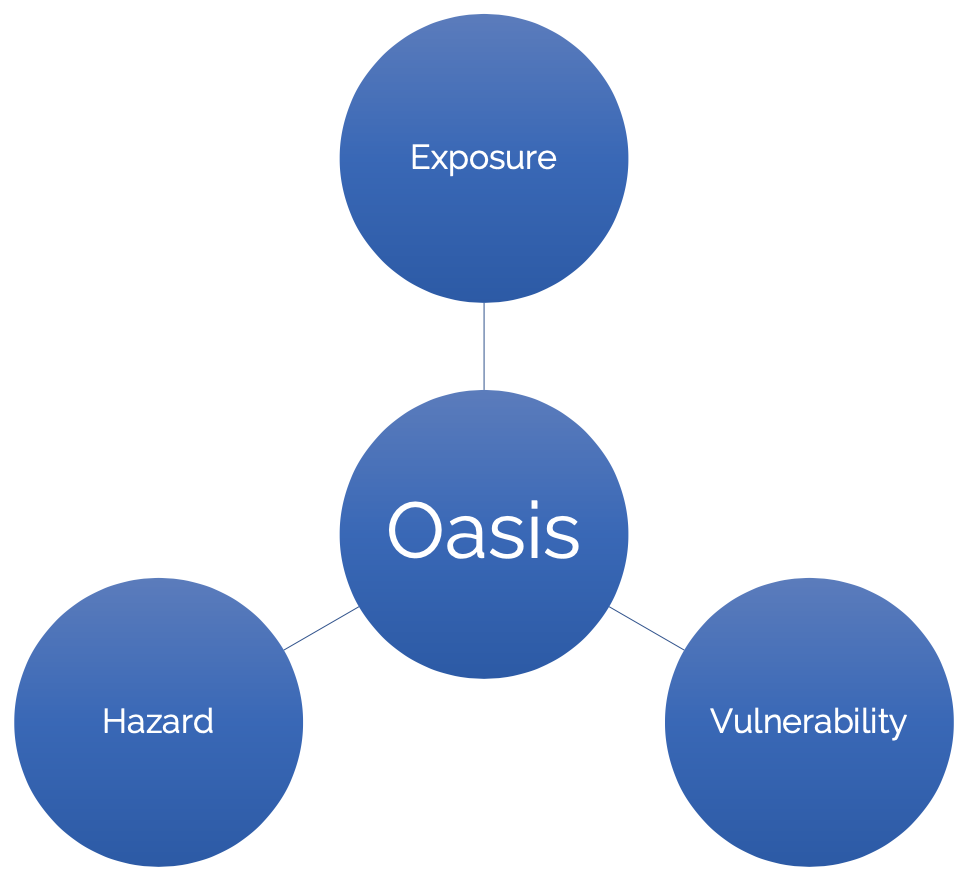

MDK - Model Development Kit
===========================

Introduction
************

----

Catastrophe models are generally made up of three modules: 

• The **hazard module** which represents the event catalogues
• The **vulnerability module** which describes the damage caused by the events
• The **Exposure module** which maps the items at risk into the model

These modules of are usually developed independently by people with the relevant expertise, and then brought together to be 
calibrated and validated, eventually forming a complete catastrophe model. However, it’s rare that the resulting catastrophe 
model is ready for immediate deployment and use because the model development and deployment systems are often quite 
different. This can lead to an often complex and lengthy process to convert the new model into a deployable set of assets, 
which can result in loss of fidelity.

|

Model Development Kit
*********************

----

This problem motivated us to build the Oasis Model Development Kit, which is an easy to install set of tools available as a 
Command Line Interface. The MDK is an open source python package which allows you to develop, test and run the components 
of an Oasis model from your workstation with minimal setup. The hazard, vulnerability and exposure modules can be developed 
and tested independently side by side but can also be used to run end to end analyses to test the generated Ground Up Losses 
(GUL) throughout the development. The MDK even allows you to run the Oasis financial module so that you can test insurance 
and reinsurance losses as well throughout the process. 

|

Deployment
**********

----

But the real benefit of the MDK is that it uses the same underlying components for model development which are used in the 
full deployment of an Oasis model. The OasisLMF python package forms the basis of the MDK, but it is also the same software 
which is used in a fully deployed model in Oasis. The codebase and the peripheral assets are all the same, which means that 
we can have a seamless transition from development to deployment without the need for any transformation step, and the 
associated risk of loss in fidelity.

|

Installation
************

----

The MDK can be installed on a laptop, server, or in the cloud. It is availible as a python package on ``PiPy`` and can be 
installed using ``pip``. The latest release version can be installed using:

.. code-block:: sh

    pip install oasislmf
|

A specific package version can be installed using:

.. code-block:: sh

    pip install oasislmf[==<version string>]
|

For those using ``zsh`` with a Mac:

.. code-block:: zsh

    pip install 'oasislmf[==<version string>]'
|

Alternatively you can install the latest development version using:

.. code-block:: sh

    pip install git+{https,ssh}://git@github.com/OasisLMF/OasisLMF
|

You can also install from a specific branch ``<branch name>`` using:

.. code-block:: sh

    pip install [-v] git+{https,ssh}://git@github.com/OasisLMF/OasisLMF.git@<branch name>#egg=oasislmf
|

.. note::
    Starting from 1st January 2019, Pandas will no longer be supporting Python 2. As Pandas is a key dependency of the MDK 
    we are **dropping Python 2 (2.7) support** as of this release (1.3.4). The last version which still supports Python 2.7 
    is version ``1.3.3`` (published 12/03/2019).

    Also for this release (and all future releases) a **minimum of Python 3.8 is required**.

|

More information on installation can be found `here <https://github.com/OasisLMF/OasisLMF#installation>`_.