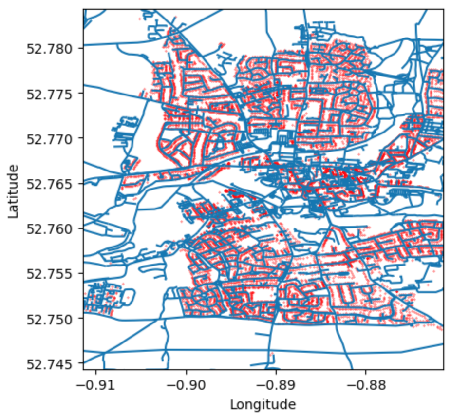
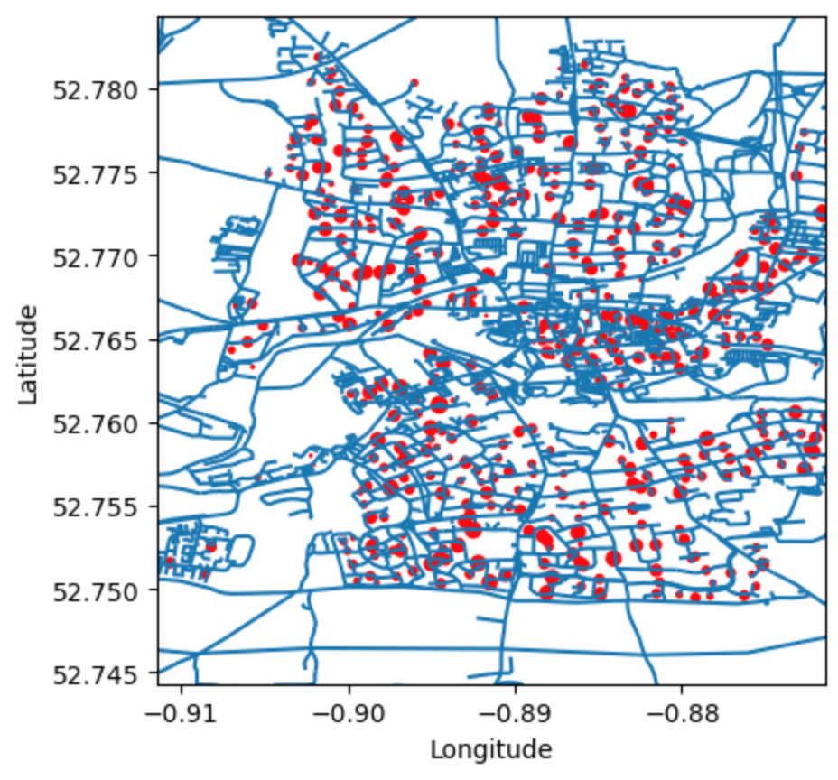
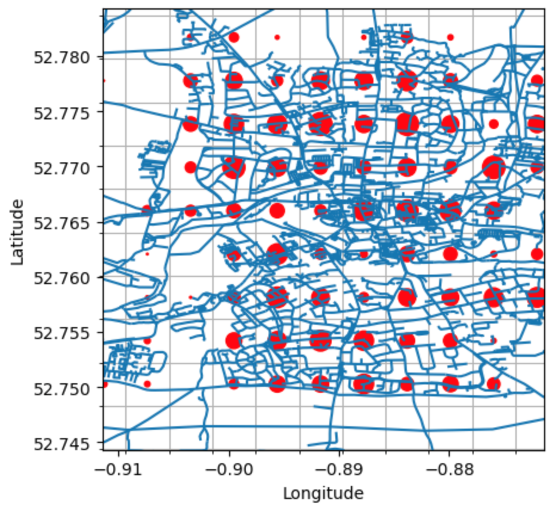

Post Loss Amplification
=======================

On this page
------------

* :ref:`intro_pla`
* :ref:`file_format_pla`
* :ref:`example_pla`

|

.. _intro_pla:

Introdcution
************

----

Major catastrophic events can give rise to inflated costs as a result of the shortage of labour, materials and other factors. 
Conversely, in some cases the costs may be lower as the main expenses may be shared among the sites that are hit in the same area. 
To account for this, the ground up losses produced by the GUL calculation component (either ``gulpy``, ``gulmc`` or ``gulcalc``) 
are multiplied by **post loss amplification factors** by the component ``plapy``. 

These are static, event-by-event based uplift factors and are applied after GUL calculation based on intensity and size of event 
as a whole. The factor also takes into account location (to some degree). This uplift factor adjusts loss based on the inflated 
costs to rectify damages following a major event - since costs of labour, materials, loss adjustment expenses, etc. can go up / 
down due to demand and economy of scale.

The uplift factor file includes the following data:

* event_id
* amplification_id
* uplift_factor

In addition to the uplift factor file, modellers can provide a mapping file from amplification_id to OED field(s) and values. 
This allows a modeller to provide, say, Country based uplift factors or custom zones to be mapped from a FlexiLoc 
field in the OED file to be defined.

Total loss is not capped at TIV - i.e. losses out of the gul calculation component can be larger than TIV and FM to behave as 
normal - i.e. not affected

There is also an option for a runtime user supplied secondary-factor. This involves the user providing an additional, flat factor 
to be applied to the uplift factor from the file. For example:

|

.. image:: /images/post_loss_amplification_table.png
    :width: 400 px
    :align: center
|

The uplift factor is applied after the GUL calculation and is it's own module. This is so that it can be applied to gulcalc, 
gulpy or gulmc...or complex model wrapper implementations. However, if elements from the logic can be inherited by gulpy/gulmc to 
improve performance, this is also an option.

|

.. _file_format_pla:

File format
***********

----

The method comprised of 5 components:

* ``amplificationstobin``
* ``amplificationstocsv``
* ``lossfactorstobin``
* ``lossfactorstocsv``
* ``plapy``

The file ``static/lossfactors.bin`` maps **event ID - amplification ID pairs** with post loss amplification factors, and is 
supplied by the model provider. The components ``amplificationstobin`` and ``amplificationstocsv`` convert this file between csv 
and binary formats. The binary format for this file is defined as follows:

* the first 4 bytes are reserved for future use
* ``event_id`` (4-byte integer)
* number of amplification IDs associated with the aforementioned event ID (4-byte integer)
* ``amplification_id`` (4-byte integer)
* ``factor`` - the uplift factor (4-byte float)

This is then followed by all the **amplification ID - loss factor pairs** associated with the event ID. Then the next event ID is 
given.

The file ``input/amplifications.bin`` maps item IDs to amplification IDs. Keys with amplification IDs are generated by the OasisLMF 
(MDK) key server according to the strategy given by the model provider. These are used to generate the amplifications file. The 
components amplificationstobin and amplificationstocsv convert this file between csv and binary formats. The binary format for 
this file is defined as follows:

* the first 4 bytes are reserved for future use.
* ``item_id`` (4-byte integer)
* ``amplification_id`` (4-byte integer)

The component ``plapy`` uses the files ``static/lossfactors.bin`` and ``input/amplifications.bin`` to assign loss factors to 
**event ID-item ID pairs** from gulpy. Losses are then multiplied by their corresponding factors. Loss factors that are not found 
in the loss factors file are assumed to be 1. The output format is identical to that of gulpy: event ID, item ID, sample ID 
(sidx); and loss.

The file ``static/lossfactors.bin`` is supplied by the model provider, and maps **event ID - amplification ID pairs** to loss factors. 
The file ``input/amplifications.bin`` is generated from the keys file. A strategy to assign amplification IDs to fields in the source 
locations file can be supplied by the model provider. If present, amplification IDs are assigned to keys. If there are no 
amplification IDs,

If ``input/amplifications.bin`` is present, the Ground Up Loss (GUL) output is piped through plapy.

|

.. _example_pla:

Example implementation of Post-Loss-Amplification
*************************************************

This example demonstrates how a post loss amplification strategy is implemented in `PiWind <https://github.com/OasisLMF/OasisPiWind>`_,
a toy model representing ficticious events with wind and flood affecting the Town of Melton Mowbray in England.

This example creates amplification IDs based on the post code of the properties in the model. Each location is represented by a 
red dot:

|

|

Locations are grouped by post code (locations file field ``PostalCode``). The means of the latitudes and longitudes for each 
location with a given post code give the physical positions, and each position is given a weight proportional to the number of 
locations that share that post code. Each red dot below represents a group, where the radius is proportional to the weight:

|

|

A grid is constructed over this, and the above points are grouped as shown below (sizes of the red dots are proportional to the 
sum of the weights that lie within each grid):

|

|

These grid-tiles discretise the weights so the **post loss amplification factors** can be applied depending on the  inflation / 
deflation experienced from that event.