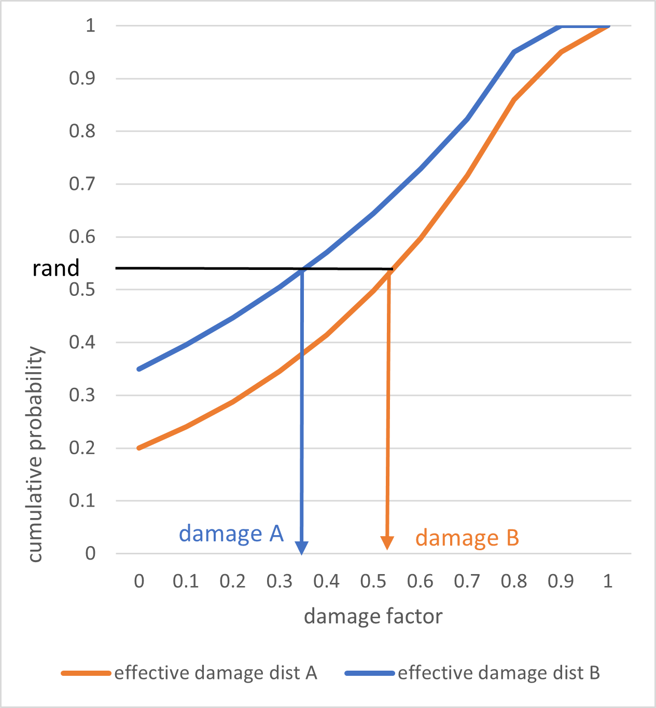
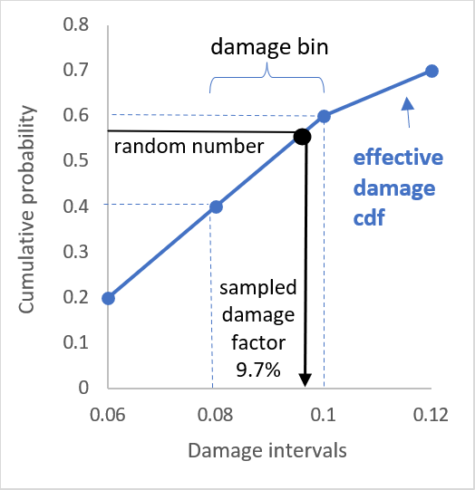

Sampling Methodology
====================

On this page
------------

* :ref:`introduction_sampling`
* :ref:`features_by_version`
* :ref:`effective_damageability`
* :ref:`monte_carlo_sampling`
* :ref:`numerical_calculations`
* :ref:`loss_allocation`
* :ref:`available_1.27`
* :ref:`latin_hypercube_sampling`
* :ref:`correlated_random_numbers`

|
.. _introduction_sampling:

Introduction
************

----

This section explains the full ground up loss calculation, which consists of two main stages;

1) calculation of probability distributions
2) the sampling method

This section cover the inputs to the ground up loss calculation and how they control the random numbers that are drawn, the seeding of random numbers, the algorithms used to draw random numbers and the method of generating partially correlated random numbers more recent releases of Oasis. 

|

.. _features_by_version:

Sampling features by version
****************************

----

More features have been added in the more recent oasislmf package versions.

These can be summarized as follows;

*  1.27
	*	Latin Hypercube sampling
	*	Partially correlated random numbers for damage
	*	Full Monte Carlo Sampling
	* 	Partially correlated random numbers for hazard intensity

|

.. _effective_damageability:

Effective damageability method
******************************

----

Effective damageability is the name of the method used for the construction of probability distributions.

The model input files to this stage of the calculation are;

* footprint
* vulnerability

Hazard intensity uncertainty is represented in the footprint data, and damage uncertainty given the hazard intensity is represented in the vulnerability data. Both types of uncertainty are represented as discrete probability distributions.

Effective damage is calculated during an analysis by combining ('convolving') the hazard intensity distribution with the conditional damage distribution.

In the general case, the calculated effective damage distribution represents both uncertainty in the hazard intensity and in the level of damage given the intensity.  

However it is common in models to have no hazard uncertainty distribution in the footprint. This is when each areaperil (representing a geographical area/cell) in the footprint is assigned a single hazard intensity bin with probability set to 1.  In this case, the effective damage distribution is still generated but it is the same as the conditional damage probability distribution in the vulnerability file for a single intensity bin.  

Under the effective damageability method, it is always the effective damage distribution that is sampled, but the sources of uncertainty that are represented may be just damage, or may be a combination of hazard intensity uncertainty and damage uncertainty, depending on the model files.

.. _monte_carlo_sampling:

Monte Carlo sampling
********************

----

Monte Carlo methods are a broad class of computational algorithms that rely on repeated random sampling to obtain numerical results. 

The Oasis kernel performs a Monte Carlo sampling of ground up loss from effective damage probability distributions by drawing random numbers. 

The probability distribution is provided by the effective damageability calculation described above, and the damage intervals are provided by a third model input file, the damage bin dictionary. 

**Exposure inputs**

The exposure data input files control all aspects of how ground up losses are sampled. The inputs are two related files;

*	items
*	coverages 

Items are the smallest calculation unit in Oasis, and they represent the loss to an individual coverage of a single physical risk from a particular peril. The coverage file lists the exposure coverages (for example the building coverage of an individual site) with their total insured values.

The attributes of items are;

* item_id - the unique identifier of the item
* coverage_id - identifier of the exposure coverage that an item is associated with (links to the coverages file)
* areaperil_id - identifier which determines what event footprints will impact the exposure and with what hazard intensity
* vulnerability_id - identifier which determines what the damage severity will be given the hazard intensity
* group_id - identifier that generates a set of random numbers that will be used to sample loss

The attributes of coverages are;

* coverage_id - the unique identifier of the exposure coverage
* tiv - the total insured value of the coverage 

For each item, the values of areaperil_id and vulnerability_id determine the inputs to the calculation of the effective damage distribution for each event, the group_id determines which set of random numbers will be used to sample damage, and the coverage_id determines what tiv the damage factor will be multiplied by to generate a loss sample.  

See correlation.rst for more information about how group_ids are generated.

**Random number seeding**

A random number set is seeded from the input keys 'event_id' and 'group_id'. This means that for each unique set of values of 'event_id' and 'group_id', an independent set of random numbers is drawn.  The size of the random number set is determined by the number of samples specified in the analysis settings.

Seeded random number sets are repeatable. This means that for the same value of 'event_id' and 'group_id', the set of random numbers generated will always be the same.

Whereever items are assigned the same group_id,  the same set of random numbers will be used to sample ground up losses. The damage samples are fully correlated for these items, whereas they are uncorrelated to all items with different assigned group_ids.

Note that just because the random numbers used to sample from two item's damage distributions are the same does not mean the sampled damage factors will be the same. The damage factor will also depend on the cumulative distribution function, which will vary across items. 

However, damage samples will have 'rank' correlation, meaning that the largest damage factors for two fully correlated items across the sample set will occur together, and the second largest damage factors will occur together, and so on.

**Full correlation sampling across two different effective damage cdfs**

|

**Inverse transform sampling**

Inverse transform sampling is a basic method for psuedo-random number sampling, i.e. for generating sample numbers at random from any probability distribution given its cumulative distribution function.

In Oasis, all probability distributions are discrete.  The cumulative probability is calculated for each damage interval threshold and the random number (a value between 0 and 1) is matched to a damage bin when its value is between the cumulative probability lower and upper threshold for the bin.  Linear interpolation is performed between the lower and upper cumulative probability thresholds to calculate a damage factor between 0 and 1.

**Inverse transform method for a discrete cumulative distribution function**

|

Each damage factor is multiplied by the total insured value of the exposed asset to produce a ground up loss sample. This is performed at the individual building coverage level, for each modelled peril, for every event in the model.  This is repeated for the number of samples specified for the analysis.

|

.. _numerical_calculations:

Numerical calculations
######################

----

|

.. _loss_allocation:

Loss allocation
###############

----

|

.. _available_1.27:

Available in OasisLMF 1.27
#########################

----

|
.. _latin_hypercube_sampling:

Latin Hypercube sampling
************************

|

.. _correlated_random_numbers:

Correlated random numbers
*************************

A one-factor Gaussian copula generates correlated random numbers across group_ids for each peril group and event. 

For an event, for each peril correlation group k and sample j, a random number Y_jk  ~ N(0,1) is generated as the correlated random variable across groups. It is seeded from the event, sample j and peril correlation group k so that it repeatable.

For each event, sample j and group_id ik (ik = i locations times k peril groups), one random number, X_ijk  ~ N(0,1) is generated as the noise/uncorrelated variable. The group_id is hashed from the location details and the peril correlation group id so that the random numbers are repeatable for the same item group and peril correlation group across analyses.

The dependent variable Z_ijk  ~ N(0,1) for peril correlation group k, sample j and group_id ik is

Z_ijk=Y_jk √(ρ_k )+X_ijk √(〖1-ρ〗_k )

Where ρ_k is the input correlation factor for peril correlation group k.

The normal inverse function is used to transform independent uniform random numbers generated from the chosen RNG function (Mersenne Twister / Latin Hypercube) into the normally distributed random variables, X_ijk and Y_jk. The cumulative normal distribution function is used to transform the dependent normally distributed Z_ijk values to the uniform distribution, which are the correlated uniform random numbers to use for damage interpolation of the cdf.

Future enhancements 

We agreed that we would continue to investigate and document the enhancements to the correlation model to include more options for coverage correlation within each group, and a chance of loss factor which would ensure the sampled correlations between losses are closer to the input correlation factor. The sampled correlation can be less than the input correlation factors in cases where zero losses for some locations are generated.

These features can be added to the backlog for future implementation.

Correlation model extended to coverages

The one-factor Gaussian copula model can be extended to a multi-factor model to allow for different correlation factors between the coverages within an item group.  The proposal is to enable a different factor to be entered for buildings and contents loss correlation, buildings and BI loss correlation, and contents and BI loss correlation.

For i=1,…,N groups, with peril group correlation (ρ_k), buildings-contents correlation (ρ_BC), buildings-BI correlation (ρ_BBi) and contents-BI correlation (ρ_CBi), the correlated normally distributed random values can be generated from the following expressions.

Z_(ijk,B)=Y_jk √(ρ_k )+Y_1ijk √(ρ_BC )  +Y_2ijk √(ρ_BBi )+              +X_(ijk,B) √(1-ρ_k-ρ_(BC   )-ρ_BBi                )      

Z_(ijk,C)  =Y_jk √(ρ_k )+Y_1ijk √(ρ_BC )+                 +Y_3ijk √(ρ_CBi )+X_(ijk,C) √(1-ρ_k-ρ_BC                - ρ_CBi  )    

Z_(ijk,Bi)=Y_jk √(ρ_k )+              +Y_2ijk √(ρ_BBi )  +Y_3ijk √(ρ_CBi )+X_(ijk,Bi) √(1-ρ_k              -ρ_BBi  - ρ_CBi )

Where Y_jk,Y_1ijk,Y_2ijk,Y_3ijk,X_(ijk,B),X_(ijk,C),X_(ijk,Bi)  are N(0,1) distributed. 

Y_jk is the global variable drawn once for all risks for each sample j and peril correlation group k, Y_1ijk,Y_2ijk,Y_3ijk are drawn for each group ik and sample j but are the same for each coverage, and〖 X〗_(ijk,B),X_(ijk,C),X_(ijk,Bi)  are drawn for each coverage, group ik and, sample j.

There is not a free choice of each correlation factor between 0 and 1 because the last term in each of the above expressions cannot go negative under the square root. The requirement is that the correlation matrix of the coverage correlations must be positive definite, so some work is needed to work out the rules of how these correlations may be specified, and how to control the inputs to ensure the combinations of values entered are valid. A rule must also be specified for generating the ‘Other structure’ coverage random number, if this coverage is present.
